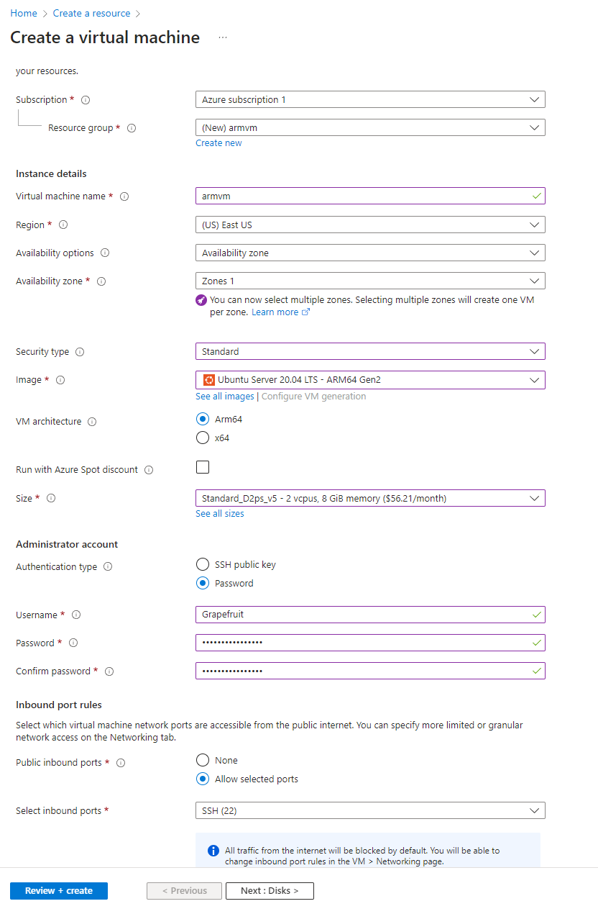

# Azure ARM VM Emulator Host

Instructions for how to set up an emulator on an ARM Azure VM

## Create The VM

Azure > Create a resource > VM. Use the following options:  



The default options on the rest of the pages will work fine  

Setup Auto shutdown once you create the VM  

Then go to the connect tab and copy the ssh string  

<br />

## RDP to the Azure VM

In the Azure console for the VM, go to Networking tab > Add inbound port rule, and allow inbound connections from any host and any port on 3389 (RDP)  

In an ssh session to the Azure VM, run the following:  
- `sudo DEBIAN_FRONTEND=noninteractive apt-get -y install xfce4`
- `sudo apt install xfce4-session`
- `sudo apt-get -y install xrdp`
- `sudo systemctl enable xrdp`
- `sudo adduser xrdp ssl-cert`
- `echo xfce4-session >~/.xsession`
- `sudo service xrdp restart`  

Use xfreerdp to connect to the RDP server:
- `sudo apt-get install freerdp2-x11`
- `xfreerdp /v:172.178.80.59 /u:Grapefruit /p:p@sswordHere /size:100%`

<br />

## Install Android Studio on Azure VM

SCP the android studio tar to the Azure VM  
Uncompress it:  
- `tar -xvf android-studio-2022.3.1.18-linux.tar.gz`

Install Java:
- `sudo apt install openjdk-17-jdk`

Connect an RDP session  
Run `bin/studio.sh`

<br />

## Install Tooling on Azure VM

Install Docker by going to the official docker install page and following the directions  

Install ADB:
- `sudo apt-get install android-tools-adb`

Install redroid Docker container dependencies:  
- `sudo apt install linux-modules-extra-`uname -r`
- `sudo modprobe binder_linux devices="binder,hwbinder,vndbinder"`
- `sudo modprobe ashmem_linux`  

**Note**: the modprobes are not persistent, you will need to run them again every time you boot the VM  
However, you can make the modules load automatically with the following:  
```sh
echo "binder_linux" | sudo tee -a /etc/modules-load.d/modules.conf
echo "ashmem_linux" | sudo tee -a /etc/modules-load.d/modules.conf
echo 'options binder_linux devices="binder,hwbinder,vndbinder"' | sudo tee /etc/modprobe.d/binder_linux  
# Then, reboot. Check success with:
systemctl status systemd-modules-load.service
```

Run the container:
```sh
docker run -itd --privileged \
 --name androidemu \
 -v ~/data:/data \
 -p 5555:5555 \
 redroid/redroid:11.0.0-latest
```

It should connect automatically:
- `adb devices`

If it doesn't:
- `adb connect localhost:5555`

Install scrcpy (On Your Host - Not the Azure host...)
- `sudo apt-get install scrcpy`  

On your local host, setup the Azure host for a port forward:
- `ssh -L 5555:127.0.0.1:5555 -N -f Grapefruit@172.178.80.59`

Connect to the emulator with a local adb through the port forward:
- `adb connect 127.0.0.1:5555`  

Connect to the emulator's screen from your local host:  
- `scrcpy -s 127.0.0.1:5555`
- Note: `127.0.0.1:5555` is the device name in the output of `adb devices`  

Cleanup:
- Exit all ADB shells and scrcpy sessions on local host
- On Azure VM: `adb kill-server`  
- On Azure VM: `docker stop android emu`
- Close all connections to the Azure host
- Stop the VM from the Azure Overview Tab
- Status should say: `Stopped (deallocated)`

Note: If you have more than one adb device attached in `adb devices` you can use `-s` to specify which one you are trying to interact with. For example:  
- `adb -s 127.0.0.1:5555 shell`  

<br />

## Setup Site-to-Site VPN from Local->Azure

This will enable network communications between VMs running locally, and the ARM VM in the Azure cloud  

Follow the instructions in this video, with some minor change: https://www.youtube.com/watch?v=MorG47BTttU  
- The GatewaySubnet in the virtual network must be /27, not /28  


