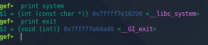
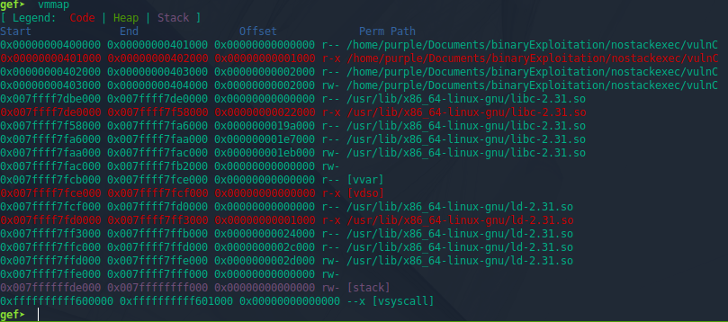
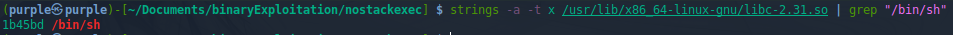
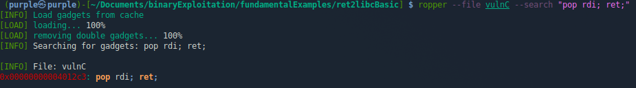

# ret2libc Basics

This is one way of attacking a binary that has a non-executable stack
These notes are from the exploitation in [2_ret2libcBasic](./fundamental_examples/2_ret2libcBasic/exploit.py)  
We can start by finding the address of the &lt;system&gt; and &lt;exit&gt; library functions using gdb `print` command:  
  
 
Next, use `vmmap` to find the base memory location of libc:

The address of libc that we are looking for is the first one, `0x007ffff7dbe000`  

Next, use the `strings` and `grep` linux commands to find the offset within `libc-2.31.so` that `/bin/sh` is at:  

We want to pass a pointer to the string "/bin/sh" to the system() function call  
On 32-bit, this would be easier because the calling convention just pops the stack and uses that as a parameter  
On 64-bit however, rdi is used to store the parameter when we call  
Because of this, we are going to have to figure out a way to get a pointer to a string into the rdi with a non-execable stack  
To do this, we use `ropper` to find set of instructions (aka a gadget) that pops a value into rdi and returns right away  
  

Note: Sometimes there may be no perfect gadgets available. If that is the case, and there are some extra instructions between the ones we need and ret, we may have to adjust our payload accordingly  
Note: `radare2` (`r2`) can also be used to find gadgets, similarly to ropper: `r2 vulnC` and then `/R pop rdi` would find the same gadget. Ropper is better though in my experience  
Now we have all the pieces, its time to construct our payload  
The payload is going to be `|| Buffer Overflow || pop rdi gadget address || ptr to bin/bash string || extra ret instruction for alignment || system address || exit address ||`  
x64 requires that calls be made from 16-byte aligned locations on the stack. The ptr to `"/bin/bash"` unaligns us by 8 bytes. We can use the address of our return in the pop rdi gadget as an extra ret instruction to keep our stack 16-byte aligned