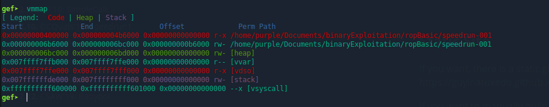

# ROP Basics

ROP, or Return Oriented Programming involves hijaking the target executables control flow to execute chosen assembly instructions that are already present in the executable's memory  
These instructions are called gadgets

For this example we will use a statically compiled executable called speedrun-001 which has no-stack-exec enabled  
This exploitation is in [3_ropBasic](./fundamental_examples/3_ropBasic/exploit.py)  
We find that the executable is vulnerable to a buffer overflow, with an overflow size of 1032 bytes  

Because the target is a fairly large statically linked executable, we have a wide selection of gadgets to choose from  
We can write "/bin/sh" to memory, and then execute a syscall command with all the right parameters to pop a shell. No libc needed  

We will be attempting to execute a `syscall` instruction with parameters: **1)** 0x3b (rax) **2)** pointer to /bin/sh (rdi) **3)** 0x0 (rsi) **4)** 0x0 (rdx)  
To do this, we will need a `pop <register>; ret;` gadget for each register:  
We can find those easily with ropper:  
`ropper --file speedrun-001 --search "pop rax; ret;"`  
and so on for each of the other registers  
 
We also need a way to get "/bin/sh" into memory so we can have a pointer to it  
We can do this with a `mov` gadget such as: `mov qword ptr [rax], rdx; ret;`  
We can find such gadgets using: `ropper --file speedrun-001 --search "mov \[rax\]"` and searching through the available gadgets
We also need a writeable memory address where we can store this string. We can find one with vmmap:
  
`0x6b6000` is a writeable memory address  
We should examine its contents with `x/64x 0x6b6000` to make sure we are overwriting just 0s and nothing significant  

**Assembling the Payload**  
Now we just have to shove our gadgets onto the stack into the correct order  
The structure will be like this:  
\[pop rax gadget\] \[writeable memory address\] \[pop rdx gadget\] \["/bin/sh\\x00"\] \[mov gadget\] \[pop rax gadget\] \[0x3b\] \[pop rdi gadget\] \[writeable memory address\] \[pop rsi gadget\] \[0x0\] \[pop rdx gadget\] \[0x0\] \[syscall gadget\]  

And voila! we've got a shell