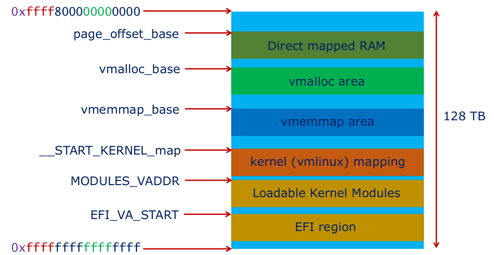

# Linux Kernel Internals Overview

## Processes and Threads

Threads represent independent execution contexts  
Processes are containers of resources  

A process is created when an ELF executable is spawned. A single thread is created as a result of process creation which calls the process entry point.  

Each thread in the system is represented by a `struct task_struct` and identified by a pid  
- `task_struct` points to other structures representing resources allocated to the thread  

The primary thread in a process is created at the time of process creation  
- `task_struct` of this thread also represents the process  

The per-CPU variable `current` points to the `task_struct` of the thread executing on the CPU  

 

## Process Memory Management  

Process has its own private VA space  

`struct mm_struct`  
- Defines the user virtual address space of a process  
- Contains the root of the `vm_area_struct` tree and a list head of the doubly linked list of `vm_area_struct`s  

`struct vm_area_struct`
- Represents a contiguous virtual address range that is allocated in process' user address space  

 

## Kernel Virtual Address Space

During system startup, KVAS is statically divided into regions, each one used for a specific purpose  
- Base VA of some regions are randomized (KASLR)  

All of physical memory is directly mapped into KVAS. This is called the direct mapped RAM region  

Kernel VA Space:  
  

The kernel maintains metadata for every physical page in the system using `struct page`  

The array of `struct page` structures for each physical page is kept in the `vmemmap` region of KVAS  

