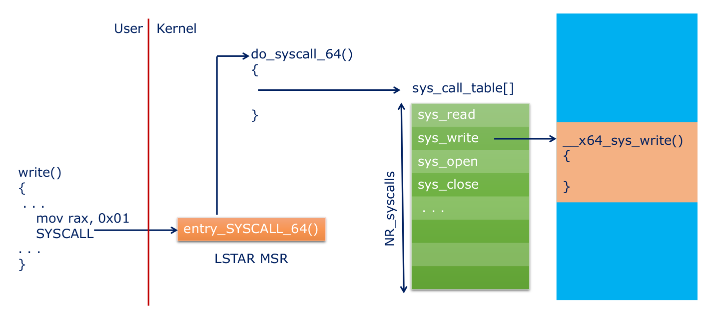
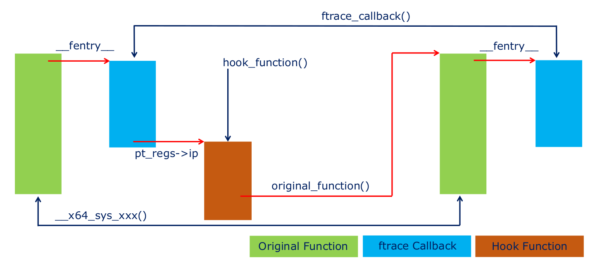

# Interception

## kretprobe hooking

kretprobe hooking allows you to intercept kernel functions to tamper with the return value  

Registering a kretprobe requires the name of the function to be probed and the pointer to the handler  

See how to register a kretprobe to neuter file permission checks in this lab: [hook_function](../LKXR_labs/hook_function/hook_function.c)  

 

## Syscall Hooking

The kernel global `sys_call_table` is an array of function pointers used to call kernel system call entry points  

`__x64_sys_xxx()` called by `do_syscall_64()`  

The index of a function in the Syscall table is represented by the constant `__NR_xxx`  
- Defined in `asm-x86/unistd_64.h`  

The entire `sys_call_table[]` array is read-only  

Syscall routing:  
  

### **Finding the Syscall Table**

Older methods to get the `sys_call_table` don't work
- `kallsyms_lookup_name()` is no longer exported  

`kprobe` allows a probe to be set on a symbol and the address of the symbol is made available as a result  
- This technique can be used to locate non-exported symbols such as `sys_call_table[]`  

### **How to Syscall Hook**

Replace function poiinters in the `sys_call_table[]` array with attacker controlled hook function pointers  

All system call functions have the same prototype:
- `long __x64_sys_xxx (struct pt_regs *regs);`  

 

Learn how to hook the `openat` syscall to dump its parameters in this lab: [hook_syscall](../LKXR_labs/hook_syscall/hook_syscall.c)  

 

## Notifier Chains

Publisher-subscriber interface for kernel modules  

One use for this is key logging  

Learn how to log keystrokes with notifier chains in this lab [hook_keyboard](../LKXR_labs/hook_keyboard/hook_keyboard.c)  

 

## Ftrace Hooking

Hooking with ftrace is a mechanism for intercepting functions in the kernel  

Callbacks are attached to the beginning of functions in order to record and trace the flow of functions  

Hooks are enabled/disabled per function by `ftrace_set_filter()`  

The ftrace callback function gets access to the CPU registers at the time of invocation via the `fregs` parameter  
- `FTRACE_OPS_FL_SAVE_REGS` must be set in `ftrace_ops.flags` for this behavior  

Ftrace hooking control flow:  
  

We use ftrace hooks in this lab to hook `getdents64()`: [hide_pid2](../LKXR_labs/hide_pid2/hide_pid.c)  

