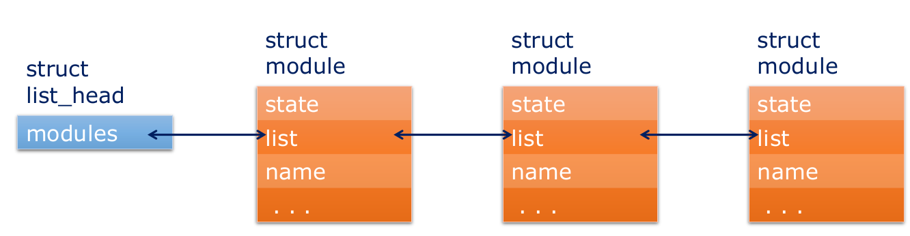

# Stealth

## Hiding Modules

Each kernel module loaded in memory is represented by `struct module` structure  

Kernel modules can access their own module data structure using the macro `THIS_MODULE`  

Kernel maintains a list of all modules in a doubly linked list anchored in the kernel variable `modules`  
This is what that list looks like:  
  

Learn how to hide modules by manipulating this list in this lab: [hide_module](../LKXR_labs/hide_module/hide_module.c)  

<br />

## Hiding Files

User mode process can discover a file/directory by enumerating the contents of the containing directory or opening the file/directory using the path name.  

Rootkits can hide a file/directory by intercepting and modifying the behavior of these operations
- `getdents64()` for enumeration & `openat()` for opening  

### **The Linux Virtual File System**

The virtual file system is an abstraction layer  

It is what makes it possible for "everything is a file" philosophy in UNIX and Linux  

VFS sits between the userspace application and the implementation of the actual filesystem  

### **VFS Hooking**  

VFS Hooking involves replacing pointers in `struct file_operations` with pointers to rootkit functions  

Every `file` struct contains a pointer to a `struct file_operations`  

```
crash> struct file  
struct file {
    ...
    const struct file_operations *f_op
    ...    
}
```

<details>
<summary> Click for crash experimentation to illustrate the concept </summary>
Lets Experiment in Crash a little bit:  
I wrote a basic Kernel module which opens three files in `init_function`, prints their addresses, and then closes them in `exit_function`:  

```C
struct file* g_file1;
struct file* g_file2;
struct file* g_file3;

int init_function(void)
{
    g_file1 = filp_open("/", O_RDONLY, 0);
    g_file2 = filp_open("/etc/passwd", O_RDONLY, 0);
    g_file3 = filp_open("/proc/cgroups", O_RDONLY, 0);

    // Note: %p will not print kernel mode pointers for security reasons. Must use %px
    pr_info("file1 pointer: %px\nfile2 pointer: %px\nfile3 pointer: %px\n", g_file1, g_file2, g_file3);

    return 0;
}

void exit_function(void)
{
    pr_info("%s\n", __func__);

    if (g_file1)
        filp_close(g_file1, NULL);
    if (g_file2)
        filp_close(g_file2, NULL);
    if (g_file3)
        filp_close(g_file3, NULL);
}
```
Notice how the third file is a `procfs` file, and the other two should be `ext4fs` files   

After grabbing the three file pointers from `dmesg`, we can dump out the contents of each of these file structs like so:  

file1:
```
crash> struct file 0xffff98ce88402000
struct file {
    ...
    f_op = 0xffffffff84050140 <ext4_file_operations>
    ...
}
```
file2:
```
crash> struct file 0xffff98ce88402200
struct file {
    ...
    f_op = 0xffffffff84050140 <ext4_file_operations>
    ...
}
```
file3:
```
crash> struct file 0xffff98ce84d76100
struct file {
    ...
    f_op = 0xffffffff84048080 <proc_iter_file_ops>
    ...
}
```

The important thing to notice here is that the f_op pointer for file1 and file2 point to the same `struct file_operations` because both of those files are part of the `ext4fs`. The procfs file points to a different `struct file_operations` (and all other proc files would point there as well)  

Note: If you were to `filp_open` a directory, instead of a file, `f_op` would point to the respective `dir_ops` structure, instead of the `file_ops` structure. For example, doing this same exercise but with "/" gives:  
- `f_op = 0xffffffff8404f880 <ext4_dir_operations>`  
</details>

We want access to `struct dir_context`. We can see that it is passed as a parameter to the `iterate_shared` function in `file_operations` with the following:  
```
crash> struct file_operations
struct file_operations {
    ...
    int (*iterate_shared)(struct file *, struct dir_context *);
    ...
}
```

`struct dir_context` has a callback function called `actor` which is called to place a single directory entry into the query buffer  

We will hook this function to skip the call to `actor` for all entries which we want to hide  

Learn how to hide files in this lab: [hide_file](../LKXR_labs/hide_file/hide_file.c)

<br />

## Hiding Processes

### **VFS Hooking (Again)**

`procfs` is a filesystem just like `ext4fs`  
Everything that we did in the previous section on hiding files is implemented at the VFS layer  
This means that we can use basically the exact same method to hide processes in `/proc`  

This is shown here: [hide_pid1](../LKXR_labs/hide_pid1/hide_pid.c)

### **Hiding with Syscall hooking**

The syscall that `ps` and `ls` actually use to enumerate directory contents is `getdents64`  

We can figure this out with: `strace ps`  
- Note on `strace`: `strace` sends its output to stderr, making it not pipeable (ie to grep or something). If we want to have access to its output on stdout, we can do something like the following:  
    - `strace ls /home/user 2>&1 | grep getdents64`  

So we can hook the `getdents64` syscall to modify the output of `/proc` enumeration.

One way to do this is with `ftrace` hooking, which is shown in this lab: [hide_pid2](../LKXR_labs/hide_pid2/hide_pid.c)  

### **Random Proc Hiding Notes:**

Each process is represented by a `task_struct`  
- `task_struct`s for all processes are maintained in a list anchored in the exported kernel global `init_task`

```
crash> whatis init_task
struct task_struct init_task;
crash> p &init_task
$5 = (struct task_struct *) 0xffffffff84c1b440 <init_task>
crash> struct task_struct 0xffffffff84c1b440  
struct task_struct {
    ...(This thing is massive)
    pid = 0x0,
    tgid = 0x0,
    comm = "swapper/0\000\000\000\000\000\000",
    tasks = {                                    
        next = 0xffff98ce80233a48,                 
        prev = 0xffff98ce8c8cba48                  
        },
    ...
}
```
The `p` command in crash can be helpful here (ie: `p init_task->comm`)  

Note the type of the `tasks` member: `struct list_head tasks;`  
