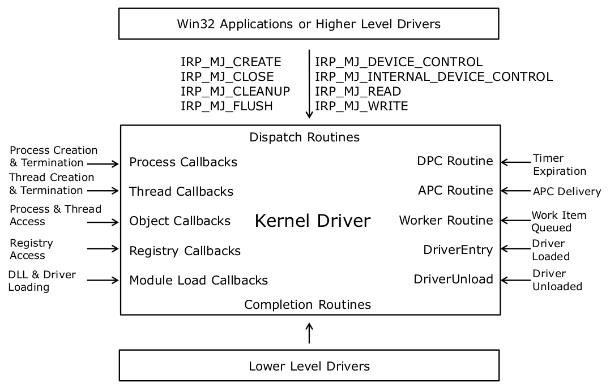
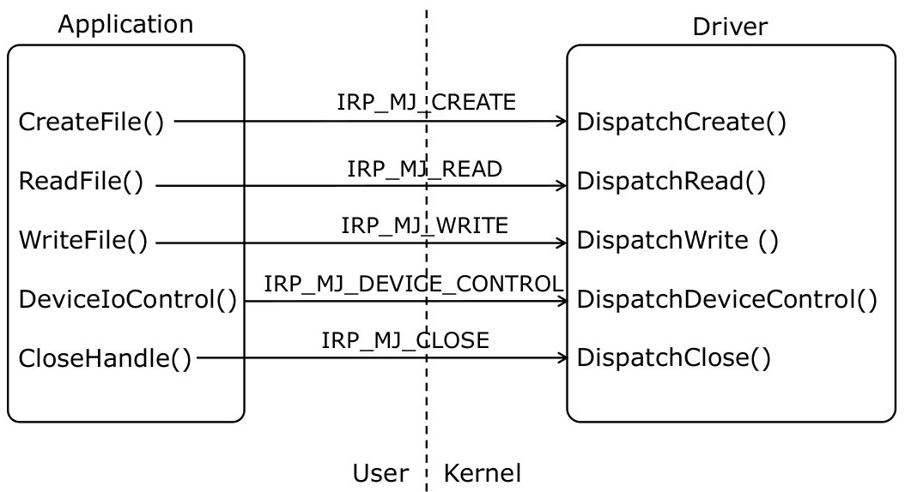

# User Kernel Interfacing

## Kernel Driver Architecture

Kernel driver functionality is exercised through the various entry points the driver registers with the system  

Entry points can be classified as follows:
- Mandatory -- Driver Entry, Driver Unload
- Execution -- Worker Routine, APC Routine, DPC Routine
- Dispatch Entry Points -- Create, Read, Write, Device I/O Control, Internal Device Control, Cleanup, Flush, Close  
- IRP Callbacks -- Completion routines, cancel routines  
- Event Callbacks -- Process, Thread, Module, Object, Registry, File System, and Networking  

This diagram shows the entry points:
  

 

## I/O Manager Objects

Driver Object (`nt!_DRIVER_OBJECT`)
- Represents an in-memory device driver image
- Contains the head of the list of device objects created by the driver  

Device Object (`nt!_DEVICE_OBJECT`)
- Represents a logical or physical device  
- Points to the driver object that created it  

File Object (`nt!_FILE_OBJECT`)  
- Represents an open instance of a device  
- Points to the device object whose open instance it represents  

Symbolic Link (`nt!_OBJECT_SYMBOLIC_LINK`)
- Represents name of a device object visible to Win32
- Points to the device object which it exposes to Win32  

 

## Driver Object

Created by I/O Manager before loading a driver
- Allocated from non-pageable memory
- Driver object passed to DriverEntry() and DriverUnload()  

Destroyed by I/O Manager after driver unloads  

`DRIVER_OBJECT` structure fields  
- `DeviceObject` is the head of the list of device objects created by device driver  
- `MajorFunction[]` contains a list of driver entry points  
    - Driver populates this array in the DriverEntry() routine  
- `DriverUnload` points to DriverUnload() routine  

 

## Device Object

Represents either physical hardware or logical device  
I/O operations are targeted at a device, not a driver  
Device object is made up of two components:  
- System defined, fixed length header (`DEVICE_OBJECT`)  
- Driver defined, variable length device extension

`IoCreateDevice()` allocates `DEVICE_OBJECT` and device extension together from `NonPagedPoolNX`  
`IoDeleteDevice()` frees the device object  
`DEVICE_OBJECT` fields:
- `NextDevice` is the next device object in the list of DOs  
- `DeviceExtension` points to the device extension area  

 

## Symbolic Links

Object Manager's `\Device` namespace and the device object names within that are not visible to Win32  

Drivers instead create a symbolic link to their device objects to make the device object accessible from Win32 
- Symbolic Link gets created in the `\Global??` directory
- Object Manager's `\Global??` namespace is accessible through Win32 API  

 

## From Theory to Practice: Exposing Device To User Mode

This lab: [ExposeUser](../WKID_labs/ExposeUser/ExposeUser.cpp) shows how to expose a device object to user mode, by creating the device object and then creating a symbolic link  

Microsoft Sysinternals has a tool called Winobj - we can use this to confirm the functionality of this lab

'CodeMachineDevice' will show up in `\Device` after we load the driver (would reccomend not using the Quick Find: search bar, it seems to be very finnicky)  

After we unload the module, it is gone  

 

## Calling a Device Driver from Win32

Win32 APIs to call into a device driver:  
- `CreateFile()`, `ReadFile()`, `WriteFile()`, `DeviceIoControl()`,
`CloseHandle()` + more  

Symbolic link is required for Win32 API to access device object  

`DeviceIoControl()` is the most flexible interface
- Simultaneous read and write semantics  

Win32 to Driver Entry Point Mapping:  

 

## I/O Request Packets (IRPs)

IRPs describe I/O requests in Windows  
IRPs are allocated by the I/O manager in response to an application calling Win32 I/O APIs  
`IoCallDriver()` is used to dispatch an IRP to a driver  

Driver dispatch routines must do one of the following:
- Forward the IRP to another driver
    - `IoCallDriver()` or `IoForwardIrpSynchronously()`  
- Complete the request in the dispatch routine
    - `IoCompleteRequest()`  
        - `IRP->IoStatus.Status` = Status of the operation
        - `IRP->IoStatus.Information` = Number of bytes produced in output buffer, if the operation is succesful
    - Return any status code other than `STATUS_PENDING`  
- Hold on to the IRP for later processing and completion
    - Mark the IRP as pending: `IoMarkIrpPending()`
    - Queue the IRP in an internal driver queue
    - Return `STATUS_PENDING` from the dispatch routine  

 

## Create and Close Dispatch Entry Points

Create and Close entry points are mandatory for drivers that communicate with Win32 applications  

Win32 API `CreateFile()`
- Called on a symbolic link name
- A `FILE_OBJECT` is created which represents an open instance of the `DEVICE_OBJECT` created by the driver  
- `IRP_MJ_CREATE` IRP is sent to the associated DO  
- The handle returned by `CreateFile()` is a user mode reference to a `FILE_OBJECT`  

Win32 API `CloseHandle()`  
- `IRP_MJ_CLOSE` IRP is sent to the associated DO  
- Handle is closed and the reference count on the file object is dropped  

Create and close dispatch entry points must complete the IRP with `STATUS_SUCCESS`  

 

## I/O Stack Locations

IRPs contain a variable number of stack locations
- Stack locations are per-driver storage area in the IRP
- Stack locations are represented by `IO_STACK_LOCATION`  

I/O stack locations are allocated along with the IRP  
The stack location of the driver processing the IRP can be retrieved using `IoGetCurrentStackLocation()`  
- The `IO_STACK_LOCATION.MajorFunction` field contains the major operation code `IRP_MJ_xxx`  
- The `IO_STACK_LOCATION.Parameters` field is a union that contains operation specific data  
    - For instance, for a `IRP_MJ_READ` request, the parameters for the read operation are in the `Parameters.Read` structure  

 

## Read and Write Operations

Win32 API `ReadFile()` is used to transfer data from a driver to a user space program  

Win32 API `WriteFile()` is used to transfer data from a user space program to the driver  

The length of the buffer is in `IO_STACK_LOCATION.Parameters.[Read/Write].Length`

 

## Putting it all together: The KernelUserIO Lab

This is a combination of the `ExposeUser`, `ConnectUser`, and `AccessUser` labs  

The end result is a user mode application `UserKernel.exe` that can make a read request to a kernel module, and in response get a buffer containing the current values of the processor's control registers  

To test, build both the user mode side and kernel mode side, load the module, and then run `.\UserKernel.exe Read`  

See here: [KernelUserIO](../WKID_labs/KernelUserIO/KernelModeSide/KernelUserIO.cpp)

