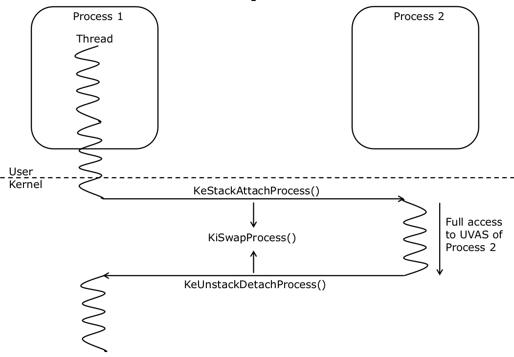

# Memory Management

## Physical Address Space

RAM is mapped into physical address space in a discontiguous manner  

The `MmGetPhysicalMemoryRangesEx()` family of functions can be used to enumerate physical RAM in the system

 

## Accessing Memory

Drivers can use `MmCopyMemory()` to read the contents of virtual or physical pages  
- Physical Memory (`MM_COPY_MEMORY_PHYSICAL`):
    - Memory range to read from can only be RAM addresses. Device memory cannot be read  
- Virtual Memory (`MM_COPY_MEMORY_VIRTUAL`):
    - Memory range can be user or kernel virtual addresses
    - Access to user space memory does not need to be protected with `__try/__except` wrappers  

Learn how to search through physical memory ranges, copy them, and then scan for PE headers with this lab: [ScanMemory](../WKID_labs/ScanMemory/ScanMemory.cpp)  

 

## Memory Descriptor List (MDL)

MDL is a system defined data structure used to describe non-pageable memory in user or kernel VAS  

MDLs can be used to map the same set of pages to multiple VAs  

Each MDL contains a fixed length header and a variable number of Page Frame Number (PFN) entries  

Using MDLs, a driver can map:
- User mode pages to kernel mode and vice-versa  
- Kernel VA range to another kernel VA range with different page access permissions  

Mapping pages involves copying contents of PTEs  

### MDL Fields:
| Field Name | Description |
| ---------- | ----------- |
| `Size` | Size of the MDL structure including the PFN Array | 
| `MdlFlgs` | Bits representing state of the MDL defined by the MDL_xxx constants in `wdm.h` | 
| `Process` | Pointer to EPROCESS of the process whose UVAS range is described by the MDL |
| `MappedSystemVA` | Kernel virtual address where the pages described by the MDL are mapped. This field is valid only if `MDL_MAPPED_TO_SYSTEM_VA` or `MDL_SOURCE_IS_NONPAGED_POOL` is set | 
| `StartVa` | Virtual address of the page containing the buffer described by the MDL | 
| `ByteCount` | Number of bytes of data described by the MDL |
| `ByteOffset` | Offset of the first byte of data described by the MDL from the start of the page |

 

Learn how to map a kernel VA range in order to change rw permissions to modify a string in a driver in this lab: [MapMemory](../WKID_labs/MapMemory/MapMemory.cpp)  

 

## Process Address Space Attachment  

Kernel mode facility enabling a thread in one process to temporarily access the UVAS of another process  

  

 

## Process Memory Access

User mode VAs can be accessed from kernel drivers  

Accessing thread must be running in the context of the process whose memory is being accessed  

Access must be performed within structured exception handler (SEH) blocks  
- `__try{} __except(){}`  

Access to kernel virtual address space cannot be protected with SEHs  

Attach to a process's address space and read the user address space of the process in this lab: [ReadMemory](../WKID_labs/ReadMemory/ReadMemory.cpp)

