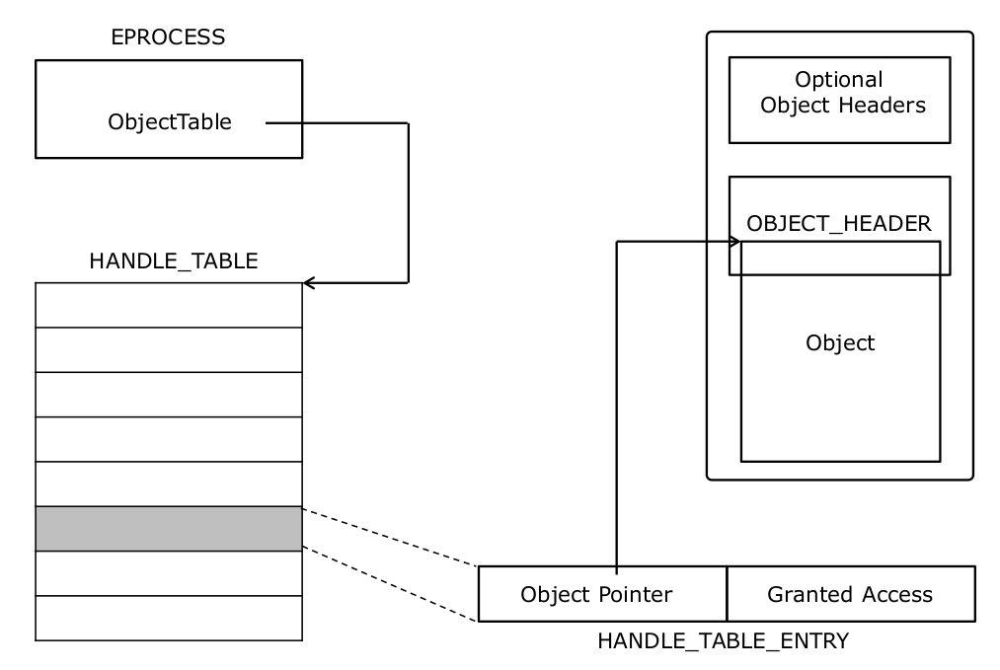

# Objects and Handles

## Handles

Every process has its own handle table
- `EPROCESS.ObjectTable` points to the handle table
- Organized as a hierarchical structure (`HANDLE_TABLE`)
- Allocated from paged pool  

A handle is a process specific reference to an object  
- Index into the handle table of a process which selects a specific handle table entry. Contains the pointer to the object and the granted access  

Handles can be inherited by a child process from its parent at process creation time (`OBJ_INHERIT`)  

### Kernel Handles
- Can be created only by drivers  
- Have the most significant bit in the handle value set  
- Valid only in kernel mode and in any process context  

Handles:

 

## Object Namespace  

System-wide non-persistent namespace organized in hierarchical format  

Primary namespace in the system
- File System and Registry namespaces are secondary  

Does not contain unnamed executive objects  

Does not support duplicate names  

| Object Directory | Description |
| ---------------- | ----------- |
| `\Global??` | Symbolic link objects. Also known as \?? and \DosDevices |
| `\BaseNamedObjects` | System-wide namespace for named executive objects (Win32) |  
| `\Sessions\<#>` | Session specific namespaces where `<#>` is the session number | 
| `\KnownDlls` | Pre-cached list of DLLs that are mapped into process memory | 
| `\Windows` | Contains the window stations for session zero |   

`ObReferenceObjectByName()` can be used to obtain an object pointer given the path to the object in the object manager namespace  
- Caller must specify a pointer to the `OBJECT_TYPE` that represents the object being looked up
    - `NTOSKRNL` global variables that point to `OBJECT_TYPE` structures are typically exported  
    - For proper linkage, drivers must declare the variable as `extern "C"` or ` `EXTERN_C`
- The absolute path to the object in the object manager namespace must be specified as a `UNICODE_STRING`  

 

## Object Referencing

Handles allow process specific access to objects  
Pointers allow process independent access to objects  

Kernel mode can obtain handles and take references whereas user mode can only obtain handles  

Objects are reference counted using 2 counters:  
- HandleCount - Number of handles open on the object  
- PointerCount - Number of handles and references on the object  

Object reference counting keeps the object around while it is in use  
- `ObReferenceObject()` and variants take references
- `ObDereferenceObject()` drops references

Object is automatically deleted when PointerCount == 0  

Learn how to obtain an object pointer given the full path name of the object in the object manager namespace in this lab: [LookupObject](../WKID_labs/LookupObject/LookupObject.cpp)

 

Learn how to enumerate the object manager namespace in this lab: [EnumObject](../WKID_labs/EnumObject/EnumObject.cpp)  

