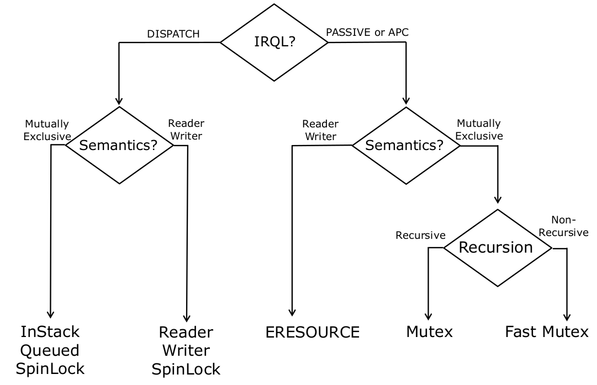

# Synchronization

## Interrupt Request Level (IRQL)

IRQL is the priority of the task performed by the CPU. The higher the IRQL, the higher the priority of the task  

IRQL is associated with a CPU, not with the system  

IRQL is a 4-bit number and set through the CPU control register CR8 (bits 3-0)  

Raising the IRQL of a CPU masks off all interrupts of equal and lower IRQL  

### **Software IRQLs**

`PASSIVE_LEVEL/LOW_LEVEL (0)`  
- User mode threads always run at `PASSIVE_LEVEL`  
- Thread priorities apply at this IRQL  

`APC_LEVEL (1)`
- Page fault handler runs at `APC_LEVEL`  
- Thread priorities apply at this IRQL  

`DISPATCH_LEVEL (2)`  
- Scheduler (dispatcher) runs at this IRQL  
- Raising the IRQL of a CPU to this level prevents preemption on that particular CPU  
- Blocking or waiting at this level causes deadlock
- Pageable memory cannot be accessed at IRQLs $\geq$ `DISPATCH_LEVEL`

 

## Events

`KEVENT` represents the kernel event data structure  
- must be stored in non-pageable memory
- must be initialized by `KeInitializeEvent()`
- Can be allocated on the stack, but `WaitMode` parameter to `KeWaitForxxxx()` must be `KernelMode` to prevent the stack from being paged out  

Drivers can share events with applications by name `IoCreate[Synchronization|Notification]Event()`

Threads can block on events using `KeWaitFor[Single|Multiple]Object[s]()`  

`KeSetEvent()` signals event  
`KeResetEvent()` sets event to non-signaled state  

Learn how to block on events and signal events in this lab: [SyncEvent](../WKID_labs/SyncEvent/SyncEvent.cpp)  

 

## Synchronization

Data structures must be protected from simultaneous access from multiple threads  

There are multiple synchronization primitives available to drivers:
- Waitable locks for low IRQL ( < `DISPATCH_LEVEL` )
    - ie: Mutexes, Fast Mutexes, ERESOURCES
- Spin locks for high IRQL (>= `DISPATCH_LEVEL`)  
    - ie: Executive Spin Locks, Interrupt Spin Locks, InStack Queued Spin Locks, Reader Writer Spin Locks  

Lock Selection Criteria:  
  

### **Mutexes**  

Mutex (`KMUTANT`)  
- Can be recursively acquired
- Disables normal APC delivery to the acquiring thread

Fast Mutex (`FAST_MUTEX`)
- Similar to mutex but cannot be recursively acquired
- Acquisition raises the IRQL of the CPU to APC_LEVEL
    - Unsafe versions of the functions do not change the IRQL  

Learn how to acquire and release mutexes in this lab [SyncSerialize](../WKID_labs/SyncSerialize/SyncSerialize.cpp)  

### **Spin Locks**

Used for synchronization at high IRQL ($\geq$ `DISPATCH_LEVEL`)  

Learn how to manipulate doubly-linked lists and serialize access to linked lists with spin locks in this lab: [SyncQueue](../WKID_labs/SyncQueue/SyncQueue.cpp)  

