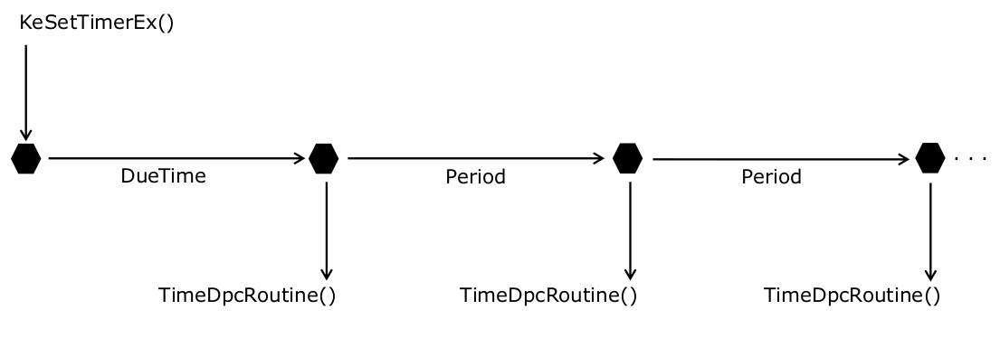

# Execution

## Querying Time

`KeQuerySystemTime()` returns the system time  
- System time is a count of 100-nanosecond intervals since January 1st, 1601 in UTC  
    - Represented by a `LARGE_INTEGER`

`LARGE_INTEGER`
- a 64-bit integer
- used extensively by kernel APIs
- Can be accessed via its individual 32-bit components

`RtlTimeToTimeFields()` converts this time to the individual time fields in the `TIME_FIELDS` structure  

Learn how to query kernel time and convert it to system time in this lab: [QueryTime](../WKID_labs/QueryTime/Querytime.cpp)

 

## Timers

The kernel provides two usage models for timers:  
- Synchronous (blocks calling thread)
    - `KeWaitForSingleObject()` and `KeDelayExecutionProcessor()`  
- Asynchronous (timer notification routine executes)
    - `KeSetTimerEx()`  

Timers are represented by `KTIMER` structure  
- Timers are dispatcher objects and waitable
- Can be configured as NotificationTimer or SynchronizationTimer during initialization  

Timers are based on Interrupt Time, which is stored in `KUSER_SHARED_DATA.InterruptTime`  

### **Timer Usage**  

`KeInitializeTime[Ex]()`
- Initializes the `KTIMER` structure to a non-signaled state

`KeSetTimerEx()`
- Sets the `KTIMER` interval (DueTime and Period)  

`KeCancelTimer()`
- Must be used to cancel timers before driver unloads
- Return value determines if `KTIMER` is still in the queue  

Timer Interval:  
  

 

## DPC

Deferred Procedure Calls (DPCs) are used to schedule high-priority activities such as:
- Timer expiration processing
- Interrupt processing

`KDPC` structure represents DPCs  

DPCs are queued to a per-CPU DPC queue  
- `KPCR.Prcb.DpcData[DPC_NORMAL].DpcList.ListHead`  
- High importance DPCs are added at the head of the CPU's DPC queue in the KPCR  

DPC routines execute at `DISPATCH_LEVEL`, in an arbitrary thread context, and on a per-CPU private DPC stack (`KPCR.Prcb.DpcStack`)  

DPC routines can be targeted to a particular CPU
- `KeSetTargetProcessorDpc[Ex]()`  

DPC routines cannot block or access pageable memory  

Types of DPCs:
- Timer DPC: KDPC object is initialized by `KeInitalizeDpc()` and
associated with a kernel timer by `KeSetTimerEx()`
- Custom DPC: KDPC Object is initialized by `KeInitalizeDpc()` and inserted in a CPU’s DPC queue `KeInsertQueueDpc()`  

 

## Work Items

Mechanism to defer execution of a function to `PASSIVE_LEVEL` and to a system thread context  

Represented by `IO_WORKITEM` structure  

Learn how to use asynchronous timers, associate a DPC with a timer, and defer work to a system worker thread in this lab: [ExecuteDefer](../WKID_labs/ExecuteDefer/ExecuteDefer.cpp)  

 

## Driver Threads

Drivers can create their own threads by calling `PsCreateSystemThread()`  
- Threads execute in the context of the system process
- Drivers should reference the handle returned by the above call and then close the handle
- Drivers must drop this reference after the thread terminates  

Prior to unloading, driver's unload routine should block on the thread object
- Ensures that the thread is terminated before driver image is unmapped from memory
- Failure to do so results in bugcheck 0xCE

Learn how to create and destroy kernel threads and implement custom driver threads in this lab: [ExecuteThread](../WKID_labs/ExecuteThread/ExecuteThread.cpp)  