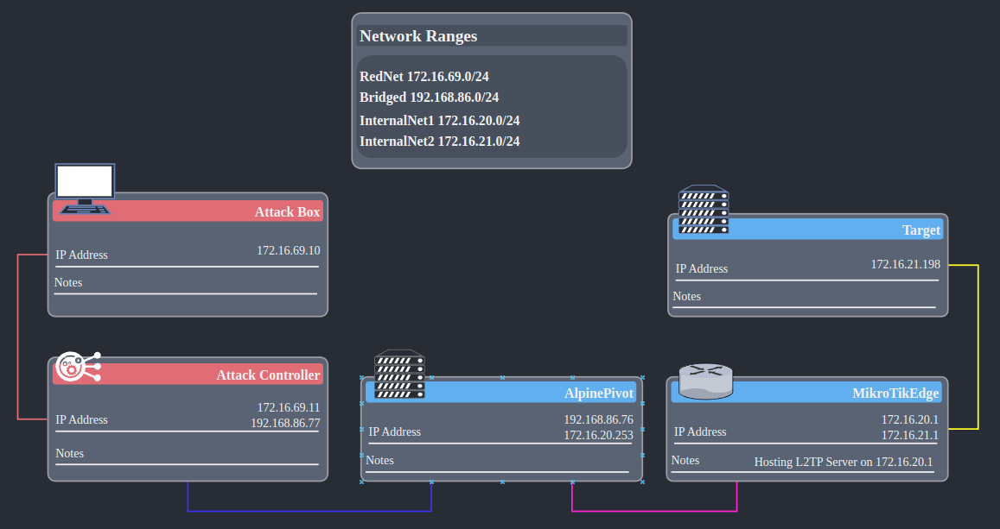

## Setting up L2TP Server

1. Create a PPP profile
```RouterOS
# "local" is the name of the bridge interface for the LAN
# "dhcp_pool0" is the name of the IP pool for the LAN
/ppp profile add name="VPN-Profile" use-encryption=yes local-address=10.10.10.1 dns-server=10.10.10.1 remote-address="dhcp_pool0" bridge="local"  
```
2. Create a VPN User
```RouterOS
/ppp secret add name=username password="abcd1234" service=l2tp profile="VPN-Profile"
```
3. Create L2TP Server Binding Interface
```RouterOS
/interface l2tp-server add name=L2TP-IF user=username
```
4. Create L2TP Server Binding
```RouterOS
/interface l2tp-server server set allow-fast-path=yes default-profile=VPN-Profile enabled=yes use-ipsec=yes ipsec-secret="12345678"
```
5. Add Firewall Rules to Allow IPSec
```RouterOS
/ip firewall filter add action=accept chain=input dst-port=500,1701,4500 in-interface=ether1 protocol=udp
/ip firewall filter add action=accept chain=input in-interface=ether1 protocol=ipsec-esp
```
6. Edit IPSec default Policy Proposal
    - In Winbox: IP > IPsec > Proposals > default
    - Check the boxes: sha1, sha256, aes-128 cbc, aes-256 cbc

7. Add Firewall rules to allow L2TP interface -> LAN and vice-versa
    - This only applies if you have a firewall rule on the forward chain set to drop everything
    - Remember to move the two rules to a higher priority than the drop rule 
```RouterOS
ip firewall filter add chain=forward action=accept in-interface=L2TP-IF out-interface=local place-before=0
```

<br />

## Setting up L2TP VPN Clients

https://github.com/hwdsl2/setup-ipsec-vpn/blob/master/docs/clients.md

### **Network Manager "BUG"**

This bug could apply to any of the GUI setup options  
Basically, Network Manager has a bug/feature to prevent the connection to the VPN server from being router over the VPN connection thereby creating a weird loop type of thing.  
So, what it does is adds a route for the address of the VPN server to go through the default gateway when the VPN connection is established.  
This might look something like this:  
```
172.21.12.1 via 10.0.2.2 dev enp0s3 proto static metric 50
```
This is fine if the VPN server is routable through the default gateway, but unfortunately, this is often not the case (as in the case above)  

To combat this, you can add a more specific route to the VPN server before you establish the VPN connection like so: 
```sh
sudo ip route add 172.21.12.1 via 172.21.12.1 dev enp0s9
```

### **Parrot With GUI**:

Click the networks icon  
VPN Connections > Add a VPN Connection...  
Select Layer 2 Tunneling Protocol (L2TP)  
VPN > Gateway is IP address of the Mikrotik  
User Authentication > User name is username  
User Authentication > Password is abcd1234  
Click IPsec Settings...
- Check Enable IPsec tunnel to L2TP host
- Pre-shared key = 12345678

Click Save  
Click the networks icon > VPN Connections and checkbox the connection  

See Network Manager "BUG" section above  

### **Mint With GUI**:

With GUI:

```sh
sudo add-apt-repository ppa:nm-l2tp/network-manager-l2tp
sudo apt-get update
sudo apt-get install network-manager-l2tp  network-manager-l2tp-gnome
```

Go to "Network Connections" (Not "Network Settings")  
Click the `+` choose connection type is L2TP  
VPN > Gateway is IP address of the Mikrotik  
User Authentication > Type = Password
- User name = username
- Password = abcd1234

Click IPsec Settings...
- Check Enable IPsec tunnel to L2TP host
- Machine Authentication > Type = Pre-shared key (PSK)
- Pre-shared key = 12345678

Click Save  
Go to "Network Settings" (Not "Network Connections") and turn on the connection  

See Network Manager "BUG" section above


### **Parrot Command Line**:

Setup:
```sh
sudo apt-get update
sudo apt-get install strongswan xl2tpd net-tools

# Create VPN Variables:
VPN_SERVER_IP="192.168.86.62"
VPN_IPSEC_PSK="12345678"
VPN_USER="username"
VPN_PASSWORD="abcd1234"

# Configure strongSwan:
sudo vim /etc/ipsec.conf
# Add this:
conn myvpn
  auto=add
  keyexchange=ikev1
  authby=secret
  type=transport
  left=%defaultroute
  leftprotoport=17/1701
  rightprotoport=17/1701
  right=192.168.86.62
  ike=aes128-sha1-modp2048
  esp=aes128-sha1

sudo vim /etc/ipsec.secrets
# Should be just this:
: PSK "12345678"

sudo chmod 600 /etc/ipsec.secrets

# Configure xl2tpd:
sudo vim /etc/xl2tpd/xl2tpd.conf
# Add this:
[lac myvpn]
lns = 192.168.86.62
ppp debug = yes
pppoptfile = /etc/ppp/options.l2tpd.client
length bit = yes

sudo vim /etc/ppp/options.l2tpd.client
# This is a new file. Add:
ipcp-accept-local
ipcp-accept-remote
refuse-eap
require-chap
noccp
noauth
mtu 1280
mru 1280
noipdefault
defaultroute
usepeerdns
connect-delay 5000
name "username"
password "abcd1234"

sudo chmod 600 /etc/ppp/options.l2tpd.client
```
Connect:
```sh
sudo mkdir -p /var/run/xl2tpd
sudo touch /var/run/xl2tpd/l2tp-control

sudo systemctl restart ipsec
sudo systemctl restart xl2tpd

sudo ipsec up myvpn # This should output a bunch of stuff. If it doesn't: did you remember to sudo systemctl restart ipsec (every time)
echo "c myvpn" | sudo tee /var/run/xl2tpd/l2tp-control
```

You will have to manually add routes. IE:  
```sh
sudo ip route add 172.21.11.0/24 via 172.21.11.1 dev ppp0
```

Disconnect:
```sh
echo "d myvpn" | sudo tee /var/run/xl2tpd/l2tp-control
sudo ipsec down myvpn
```

Troubleshooting:
```sh
sudo journalctl -xef

grep pluto /var/log/auth.log
grep xl2tpd /var/log/syslog
```

<br />

## Looking under IPSec in WireShark

On Parrot, app armor blocks charon from creating files.  
You can see this with:
```sh
sudo journalctl -xef
```
To fix this:  
```sh
sudo aa-complain /usr/lib/ipsec/charon
```

Setup logging to log crypt stuff: 
```
sudo vim /etc/strongswan.conf
# Should look like the following:
charon {    
  load_modular = yes    
  plugins {    
    include strongswan.d/charon/*.conf    
  }    
  filelog {    
    charon {    
      path = /var/log/charon.log    
      time_format = %b %e %T    
      ike_name = yes    
      append = no    
      default = 4    
      ike = 4    
      flush_line = yes    
    }    
  }    
}    
    
include strongswan.d/*.conf

sudo vim /etc/ipsec.conf
# Add the following to config setup:
config setup
  charondebug="ike 1"
```

Restart the service:
```sh
sudo systemctl restart ipsec
```

`charon.log` should be created in `/var/log`  

When we start an IPSec session, two things will now get logged:  
```sh
cat /var/log/charon.log | grep checkout
# The last one of these is what we are interested in:  
# checkout IKEv1 SA with SPIs 5829d9833cfb3f3c_i 241f4d50d477c2fd_r
cat /var/log/charon.log | grep "encryption key" -A 1
# This is what we are interested in:
# <myvpn|1> encryption key Ka => 16 bytes @ 0x7f8710003020
# <myvpn|1>    0: C5 3E 06 8B 7E AA 10 1B BE 5E 97 6D 5F 7F 19 31  .>..~....^.m_..1
```

Now, get a pcap while you initialize the IPSec connection  
Edit -> Preferences -> Protocols -> ISAKMP -> IKEv1 Decryption Table  
- The initiator's COOKIE is: 5829d9833cfb3f3c (no _i included)
- The Encryption key is C53E068B7EAA101BBE5E976D5F7F1931 

Now, on the ISAKMP packets you should be able to see the Decrypted IKE tab next to the frame tab on the bottom  

Next, we need to get the ESP tunnel keys  

These can be obtained by running:
- `sudo ip xfrm state`  

Edit -> Preferences -> Protocols -> ESP  
- Check "check sequence numbers...", "Attempt to detect/decode encrypted ESP payloads", and "Attempt to Check ESP Authentication"
- Click ESP SAs Edit... and create an entry for each of the things you got from `ip xfrm state`

For example, if this was an entry in ip xfrm state output:
```
src 172.21.12.254 dst 172.21.12.1
  proto esp spi 0x08806f95 reqid 1 mode transport
  replay-window 0 
  auth-trunc hmac(sha1) 0xd9f36565797734cd8604460775c14809f3acb482 96
  enc cbc(aes) 0x1f52601139ae2b4e3dd954f4957e8132
  anti-replay context: seq 0x0, oseq 0x0, bitmap 0x00000000
  sel src 172.21.12.254/32 dst 172.21.12.1/32
```

You would put the following in that entry:
- Protocol: IPv4
- Src IP: 172.21.12.254
- Dest IP: 172.21.12.1
- SPI: 0x08806f95
- Encryption: AES-CBC \[RFC3602\]
- Encryption Key: 0x1f52601139ae2b4e3dd954f4957e8132
- Authentication: HMAC-SHA-1-96 \[RFC2404\]
- Authentication Key: 0xd9f36565797734cd8604460775c14809f3acb482

Then you would have to do the same for the other entry that specifies the other direction  

Once you get that right, instead of seeing ESP packets for all the traffic under your IPSec, you will see the actual packets  

<br />

## Scanning IPSec

https://book.hacktricks.xyz/network-services-pentesting/ipsec-ike-vpn-pentesting

Scan with nmap to see if open:  
```sh
sudo nmap -sU -p 500 172.21.12.1
# 500/udp open  isakmp
```

Step 1: find a valid transformation:
```sh
sudo ike-scan -M 172.21.12.1
```

`--showbackoff` guessed incorrectly for Mikrotik  

<br />

## IPSec+L2TP through a redirector

Here is the hypothetical scenario:


ipsec.conf:
```
conn myvpn
  auto=add
  keyexchange=ikev1
  authby=secret
  type=transport
  left=172.16.69.10
  leftid=172.16.20.253
  leftprotoport=17/1701
  rightprotoport=17/1701
  right=172.16.69.11
  rightid=172.16.20.1
  ike=aes128-sha1-modp2048
  esp=aes128-sha1
  forceencaps=yes
```

forceencaps forces this to be 

rightid is the IP address where the response packets are actually going to be originating from. So right in this case is the redirector ip and 172.168.20.1 is the actual IPSec server ip  

xl2tpd.conf:
```
[lac myvpn]
lns = 172.16.69.11
ppp debug = yes
pppoptfile = /etc/ppp/options.l2tpd.client
length bit = yes
```

Chisel server on AttackController:
```sh
./chisel server --reverse -p 8688
```

Chisel forwards on Redirector:  
We need the following tunnels:
```
<PivotTargetNetIP>:500:<AttackBoxIP>:500/udp
<PivotTargetNetIP>:4500:<AttackBoxIP>:4500/udp
R:<AttackControllerIP>:500:<TargetServerIP>:500/udp
R:<AttackControllerIP>:4500:<TargetServerIP>:4500/udp
```
```sh
./chisel client 192.168.86.77:8688 172.16.20.253:500:172.16.69.10:500/udp 172.16.20.253:4500:172.16.69.10:4500/udp R:172.16.69.11:500:172.16.20.1:500/udp R:172.16.69.11:4500:172.16.20.1:4500/udp
```

<br />

## Troubleshooting L2TP

`journalctl -xef`
- The normal sequence of events is:
```
Connection established to 172.16.20.1, 1701.  Local: 8956, Remote: 14 (ref=0/0).
Calling on tunnel 8956
Call established with 172.16.20.1, Local: 46095, Remote: 1, Serial: 1 (ref=0/0)
...
CHAP authentication succeeded
...
not replacing default route to enp0s10 [172.16.20.1]
...
<info>  [1705068294.6600] device (ppp0): state change: unmanaged -> unavailable (reason 'connection-assumed', sys-iface-state: 'external')
...
<info>  [1705068294.6603] device (ppp0): state change: unavailable -> disconnected (reason 'none', sys-iface-state: 'external')
```

PCAP:
- `sudo tcpdump -i any -w ParrotPCAP.pcap`
- Get the ESP stuff with `sudo ip xfrm state` (see above)
- Valid:
```
-> L2TP | Control Message - SCCRQ
<- L2TP | Control Message - SCCRP
-> L2TP | Control Message - SCCCN
-> L2TP | Control Message - ICRQ
<- L2TP | Control Message - ZLB
<- L2TP | Control Message - ICRP
-> L2TP | Control Message - ICCN
<- L2TP | Control Message - ZLB
... Bunch of PPP stuff ...
-> PPP IPCP | Configuration Request
<- PPP IPCP | Configuration Ack
```
- Valid Ping:
```
196 bytes on wire
...
IPV4, Src: 172.16.20.254, Dst: 172.16.20.1
UDP: Src Port: 4500, Dst Port: 4500
UDP encapsulation of IPsec Packets
ESP
UDP, Src Port: 1701, Dst Port: 1701
Layer 2 Tunneling Protocol
Point-to-Point Protocol
IPV4, Src: 172.16.21.254, Dst: 172.16.21.198
ICMP
```

PCAP on Mikrotik Side:
- `/tool sniffer start`
- `/tool sniffer stop`
- `/tool sniffer save`
- Valid Ping:
```
# request:
190 bytes on wire
...
IPV4, Src: 172.16.20.254, Dst: 172.16.20.1
UDP: Src Port: 4500, Dst Port: 4500
UDP encapsulation of IPsec Packets
ESP
UDP, Src Port: 1701, Dst Port: 1701
Layer 2 Tunneling Protocol
Point-to-Point Protocol
IPV4, Src: 172.16.21.254, Dst: 172.16.21.198
```

Winbox logs:
- Turn on L2TP and IPSec logging
- Valid:
```
l2tp, debug, packet | rcvd control message from 172.16.20.254:1701 to 172.16.20.1:1701
...
l2tp, info | first L2TP UDP packet received from 172.16.20.254
l2tp, debug | tunnel 17 entering state: wait-ctl-conn
l2tp, debug, packet | sent control message to 172.16.20.254:1701 from 172.16.20.1:1701
...
l2tp, ppp, debug, packet | <172.16.20.254>: sent CHAP Success id=0x1
...
l2tp, ppp, debug, packet | <172.16.20.254>: sent IPCP ConfAck id=0x3
l2tp, ppp, debug, packet | <addr 172.16.21.254>
l2tp, ppp, debug | <172.16.20.254>: IPCP opened
l2tp, ppp, debug | L2TP-IF: connected
...
l2tp, ppp, debug, packet | <172.16.20.254>: sent LCP EchoReq id=0x0
l2tp, ppp, debug, packet | <magic 0x824b9b>
l2tp, ppp, debug, packet | <172.16.20.254>: rcvd LCP EchoRep id=0x0
...
l2tp, ppp, debug, packet | sent control message to 172.16.20.254:1701 from 172.16.20.1:1701
  (M) Message-Type=HELLO
l2tp, ppp, debug, packet | rcvd control message (ack) from 172.16.20.254:1701 to 172.16.20.1:1701
```

