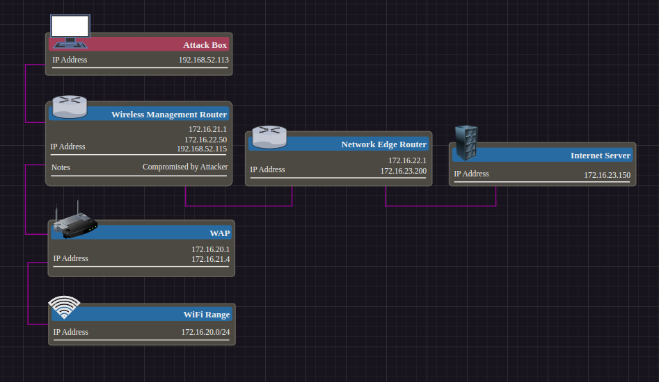

# Spoofing IP Source with SRCNAT

Here is the hypothetical scenario:



We are trying to set up a beacon on Wireless Management Router that beacons to Internet Server. Clients in the Wifi Range are allowed to establish internet connections. Network Edge Router enforces the firewall rules for these internet connections. Network Edge Router drops all traffic by default, it specifically allow lists traffic bound for the 172.16.23.0/24 range (the internet in this example) and traffic bound for the 172.16.20.0/24 range.  

The problem is that traffic bound for the 172.16.22.0/24 or 172.16.21.0/24 ranges will be dropped by the Network Edge Router. From our position on the Wireless Management Router we cannot modify those rules on the Network Edge Router. What can we do?

We can spoof our ip address with srcnat to have our outbound traffic appear to be originating from one of the clients in the WiFi range

<br />

## Configuration for Scenario

### WAP:
```RouterOS
/ip route add dst-address=172.16.23.0/24 gateway=172.16.21.1
```

### Network Edge Router:
```RouterOS
/ip route add dst-address=172.16.20.0/24 gateway=172.16.22.50
/ip firewall filter add dst-address=172.16.20.0/24 action=accept chain=forward
/ip firewall filter add dst-address=172.16.23.0/24 action=accept chain=forward
/ip firewall filter add chain=forward action=drop
```

### Wireless Management Router:
```sh
ip route add 172.16.20.0/24 via 172.16.21.4 dev eth1
ip route add 172.16.23.0/24 via 172.16.22.1 dev eth2
```

For the internet server and the client in the WiFi range, you need to add a route to the other range via 172.16.23.200 and 172.16.20.4 respectively. In the real world these IP addresses would be reachable across the internet via both devices default gateways.  

<br />

## Spoofing with srcnat

Simple, just specify all packets bound for `172.16.23.150:8686` be natted so that their source address is `172.16.20.10`

```sh
iptables -t nat -I POSTROUTING -d 172.16.23.150 -p tcp --dport 8686 -j SNAT --to 172.16.20.10
```
